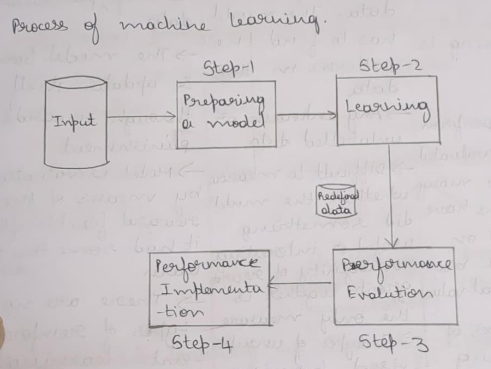

# Module 1

* **Machine Learning**:
    * A computer program is said to learn from its experience (E), with respect to some task (T) and performance measure (P). If it's performance at task as measured by 'P' improves with experience.

## Supervised Learning (Predective Learning)

* Classification
* Regression

### Classification

* Image classification
* Prediction of Disease
* Win or Loss prediction in games
* Prediction of natural calamities
* Recognition of hand writing.

### Regression

Regression -> Simple Linear Regression
           |
           -> Multiple Linear Regression

* Demand Forecasting in retail.
* Sales Prediction for managers.
* Price Prediction in real estates.
* Weather Forecast.

## Unsupervised Learning (Descriptive learning)

> Data in unsupervised learning does not contain any labels.

Descriptive Learning -> Clustering
                     |  _Customer segmentation_
                     |
                     -> Association analysis
                        _Market Baseket analysis_

## Reinforcement Learning

> Here the model learns by itself.

* Self driven cars.

## Differnce Between Supervised, Unsupervised, Reinforcement Learning

* Supervised Learning
    * This type of learning classifies data based on classes/labels.
    * Labelled training is required.
    * Performance is measured by the number of misclassifications occured.
    * Simplest to understand.

* Unsupervised Learning
    * There are no classes or labels for the data.
    * The model finds patterns in the data.
    * Difficult to understand and measure if model did something useful or interesting, Homogenity of data is the only measure.
    * More difficult to understand and implement than Supervised Learining.

* Reinforcement Learning
    * There are no classes or labels for the data.
    * Model learns and adapts through rewards and punishments.
    * Model is evaluated on the reward function after it's been given some time to learn.
    * Most complex to understand and apply.

## Attributes of data

* Qualitative -> Nominal (Non-numeric)
              |
              -> Ordinal (sequenced Nominal set)

* Quantitative -> Interval (Numeric data where we can find out exact difference)
               |
               -> Ratio (Interval type with 0 included)

## Process of Machine Learning

## Confusion matrix

* This matrix is used to calculate metrics such as Precision, Recall and Specificity.