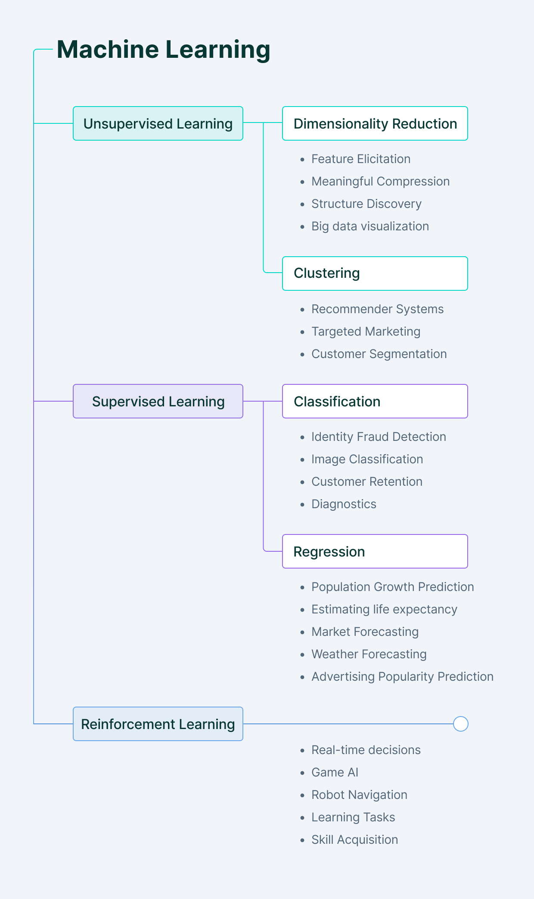

# Module 1

* **Machine Learning**:
    * A computer program is said to learn from its experience (E), with respect to some task (T) and performance measure (P). If it's performance at task as measured by 'P' improves with experience.

## Supervised Learning (Predective Learning)

* Classification
* Regression

### Classification

* Image classification
* Prediction of Disease
* Win or Loss prediction in games
* Prediction of natural calamities
* Recognition of hand writing.