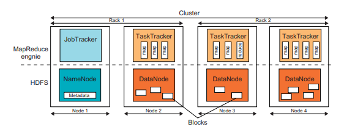
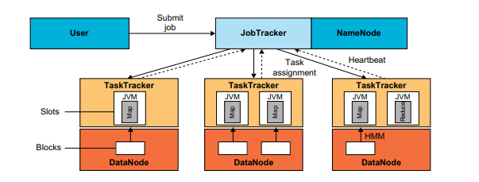
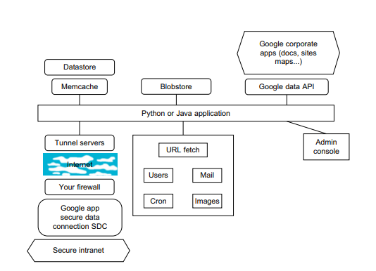

# 2. Architecture of MapReduce in Hadoop and Running a Job in Hadoop

### Architecture of MapReduce in Hadoop

MapReduce is a programming model and an associated implementation for processing and generating large data sets with a parallel, distributed algorithm on a cluster. In Hadoop, MapReduce is the core component for data processing. Here's an overview of its architecture:

1. **Input Data**: The data to be processed is usually stored in the Hadoop Distributed File System (HDFS). The input data is divided into splits, and each split is processed by a map task.

2. **Map Task**: Each map task takes a split as input and processes the data to generate key-value pairs. The map function is applied to each record in the input split. The output of the map task is a set of intermediate key-value pairs.

3. **Shuffle and Sort**: The intermediate key-value pairs produced by the map tasks are partitioned, sorted, and shuffled. Each reducer gets all the values associated with a particular key. This step ensures that all values for a given key are grouped together.

4. **Reduce Task**: Each reduce task takes the sorted key-value pairs as input and merges those values to generate the final output. The reduce function is applied to each group of values associated with the same key.

5. **Output Data**: The output of the reduce tasks is written back to HDFS. This output can then be used for further processing or analysis.

### Components of MapReduce in Hadoop

1. **JobTracker**: The JobTracker is a master node that manages the execution of MapReduce jobs. It schedules the jobs, monitors them, and re-executes the failed tasks. The JobTracker is responsible for resource management and job scheduling.

2. **TaskTracker**: The TaskTrackers are worker nodes that run the map and reduce tasks as directed by the JobTracker. Each TaskTracker manages a pool of worker threads to execute the tasks. It sends heartbeats to the JobTracker to provide updates on the status of the tasks.

3. **HDFS**: The Hadoop Distributed File System is used for storing input and output data. It is a distributed, scalable, and portable file system that provides high-throughput access to application data.

4. **JobClient**: The JobClient is a client-side component that submits the MapReduce jobs to the JobTracker. It also provides information about the job's status and statistics.

### Running a Job in Hadoop

1. **Write the MapReduce Program**: Write a MapReduce program that includes the map and reduce functions. The program should specify the input and output data formats and paths.

2. **Compile and Package**: Compile the MapReduce program and package it into a JAR file. This JAR file will be submitted to the Hadoop cluster for execution.

3. **Submit the Job**: Use the Hadoop command line interface or an API to submit the JAR file to the Hadoop cluster. The JobClient sends the job configuration and data to the JobTracker.

4. **Job Initialization**: The JobTracker initializes the job and divides it into multiple map and reduce tasks. It then assigns these tasks to TaskTrackers in the cluster.

5. **Map Phase**: TaskTrackers execute the map tasks on the input data splits. The map function processes each record and produces intermediate key-value pairs.

6. **Shuffle and Sort Phase**: The intermediate data from the map tasks is shuffled and sorted. The data is partitioned based on the keys and prepared for the reduce phase.

7. **Reduce Phase**: TaskTrackers execute the reduce tasks on the sorted key-value pairs. The reduce function processes each key and its associated values to produce the final output.

8. **Output**: The output of the reduce tasks is written to HDFS. The JobTracker updates the job status and notifies the JobClient of the completion of the job.

9. **Monitoring and Debugging**: Throughout the job execution, the JobTracker and TaskTrackers provide status updates and logs. These logs can be used for monitoring the job's progress and debugging any issues.

By following these steps, you can run a MapReduce job in Hadoop and process large-scale data in a distributed and efficient manner.

# 3. Mapping Applications to Parallel and Distributed Systems

## Mapping Applications to Parallel and Distributed Systems

### Introduction
Mapping applications to parallel and distributed systems involves leveraging the architecture of these systems to execute tasks more efficiently by dividing the work across multiple processors or machines. This approach can significantly enhance computational speed, resource utilization, and overall system throughput.

### Classification of Applications
Fox's classification of application architectures offers a structured way to understand how different applications can be adapted to parallel and distributed systems. These categories provide a historical context and an understanding of the progression and current state of parallel computing applications【14:0†source】【14:1†source】.

#### Category 1: Synchronous
- **Description**: This category is characterized by lock-step operations, where each processor performs the same operation simultaneously on different pieces of data.
- **Architecture**: SIMD (Single Instruction, Multiple Data).
- **Relevance**: Historically significant but largely obsolete in modern parallel computing due to the rigid synchronization requirements.

#### Category 2: Loosely Synchronous
- **Description**: Also known as Bulk Synchronous Processing (BSP), this category involves iterative compute-communication phases. Each processor performs independent computations that are periodically synchronized through communication.
- **Architecture**: SPMD (Single Program, Multiple Data) on MIMD (Multiple Instruction, Multiple Data) machines.
- **Applications**: Includes many scientific applications like partial differential equation solutions and particle dynamics. Synchronization is managed by communication rather than strict lock-step operations【14:0†source】【14:1†source】.

#### Category 3: Asynchronous
- **Description**: In this category, tasks interact asynchronously, which is common in event-driven simulations and certain types of combinatorial searches.
- **Architecture**: Often implemented in shared memory systems.
- **Applications**: Relevant for operating systems, concurrency in applications, and some consumer software.

#### Category 4: Pleasingly Parallel
- **Description**: Tasks are completely independent and can be executed concurrently without any need for communication or synchronization.
- **Relevance**: This category has grown significantly with the advent of grid computing and data analysis applications, such as those used in large-scale scientific research like particle physics【14:0†source】.

#### Emerging Category: Data-Intensive Computing
- **Description**: Focuses on applications that process large volumes of data, requiring significant I/O operations alongside computations.
- **Applications**: Includes big data analytics, web indexing, and other applications that handle vast datasets.

### Mapping Techniques
Mapping applications to parallel and distributed systems involves several key techniques and considerations:

#### Partitioning
- **Computation Partitioning**: Dividing a program into smaller tasks that can be executed concurrently.
- **Data Partitioning**: Splitting data into smaller chunks that can be processed independently【14:1†source】.

#### Mapping
- Assigning tasks or data chunks to specific processors or nodes in the system. This process aims to optimize resource usage and minimize communication overhead【14:1†source】.

#### Synchronization and Communication
- Ensuring that tasks running in parallel do not interfere with each other and that data dependencies are managed correctly. This involves coordinating the timing of tasks and the exchange of data between them【14:1†source】.

#### Scheduling
- Deciding the order in which tasks are executed. This includes both intra-job scheduling (managing the sequence of tasks within a single job) and inter-job scheduling (managing the sequence of multiple jobs)【14:1†source】.

### Conclusion
Mapping applications to parallel and distributed systems is a critical aspect of leveraging modern computational architectures. By understanding and applying appropriate techniques for partitioning, mapping, synchronization, communication, and scheduling, developers can enhance the performance and efficiency of their applications. This approach not only reduces computation time but also optimizes resource utilization, making it essential for tackling complex and large-scale problems in various scientific and industrial domains.

# 4.Programming environment for Google AppEngine with diagram

### Programming Environment for Google AppEngine

Google AppEngine (GAE) is a Platform as a Service (PaaS) offering that allows developers to build and host web applications on Google's infrastructure. The programming environment provided by Google AppEngine is designed to simplify the process of developing, deploying, and scaling applications. Here is an overview of the key components and features of the GAE programming environment, along with a diagram to illustrate the architecture:

#### Key Components

1. **Datastore**: 
   - GAE provides a NoSQL datastore for storing and retrieving structured data. The datastore is schema-less and allows for efficient querying and transactions. Java developers can use Java Data Objects (JDO) or Java Persistence API (JPA) interfaces, while Python developers have access to a SQL-like query language called GQL【18:1†source】.

2. **Memcache**: 
   - This in-memory caching service helps to improve the performance of applications by caching frequently accessed data. It can be used independently of the datastore【18:1†source】.

3. **Secure Data Connection (SDC)**: 
   - SDC allows secure tunneling between a user’s intranet and the GAE application over the Internet. This is essential for secure communications and data transfers【18:1†source】.

4. **Blobstore**: 
   - This service is designed for storing and serving large files, with a maximum size limit of 2 GB. It is useful for handling large data files within applications【18:1†source】.

5. **URL Fetch**: 
   - This service enables applications to fetch resources and communicate with other hosts over the Internet using HTTP and HTTPS requests【18:1†source】.

6. **User Authentication**: 
   - GAE integrates with Google Accounts for user authentication, allowing users to sign in with their existing Google credentials【18:1†source】.

7. **Image Service**: 
   - The image service allows applications to manipulate image data, such as resizing, rotating, and cropping images【18:1†source】.

8. **Cron Jobs**: 
   - Applications can perform scheduled tasks using the Cron service, which allows tasks to be run at specified intervals (e.g., daily or hourly)【18:1†source】.

9. **Task Queues**: 
   - This feature enables applications to perform background tasks asynchronously. Tasks can be added to a queue and executed outside of the normal request handling flow【18:1†source】.

10. **Quotas and Limits**: 
    - GAE enforces quotas to ensure that applications do not exceed resource usage limits, which helps to manage costs and prevent any single application from affecting the performance of others on the platform【18:1†source】.

#### Architecture Diagram

Below is a simplified diagram illustrating the programming environment for Google AppEngine:

 

(Note: The actual diagram is in the provided PDF file and cannot be displayed directly here, but the description of the components is based on the text from the document.)

#### Development and Deployment

1. **Development Environment**: 
   - GAE provides a Software Development Kit (SDK) for local development. The SDK includes tools for testing applications locally before deploying them to the GAE platform【18:1†source】.
   - For Java developers, an Eclipse plugin is available to facilitate development and debugging【18:1†source】.

2. **Supported Languages**: 
   - GAE supports applications written in Java and Python. Developers can also use other JVM-based languages such as JavaScript and Ruby through appropriate interpreters or compilers【18:1†source】.

3. **Deployment**: 
   - Once developed and tested locally, applications can be deployed to GAE, where they run on Google’s infrastructure. The platform handles scaling and resource management automatically, allowing developers to focus on coding rather than infrastructure concerns【18:1†source】.

#### Advantages of GAE

- **Scalability**: Applications can scale automatically to handle varying loads, making it ideal for applications with unpredictable traffic patterns.
- **Reliability**: Running on Google’s infrastructure ensures high availability and reliability for hosted applications.
- **Ease of Use**: With integrated tools and services, GAE simplifies the development, deployment, and management of web applications.

In summary, Google AppEngine offers a robust and comprehensive environment for developing and hosting scalable web applications, providing various tools and services to facilitate the entire application lifecycle from development to deployment.

# 6.Big-Table data model and system structure

### BigTable Data Model and System Structure

BigTable, a NoSQL system designed by Google, is aimed at storing and retrieving large amounts of structured and semi-structured data efficiently. It serves various applications, including web indexing, Google Earth, and Google Analytics, by providing a scalable and fault-tolerant storage solution.

#### BigTable Data Model

BigTable's data model is a sparse, distributed, multidimensional sorted map. The data model can be understood through the example of a "Web Table," which stores information about web pages:

1. **Rows**: Each row is identified by a unique key, such as a URL. Rows are maintained in lexicographical order by the row key, which allows for efficient range queries.
2. **Columns**: Column keys are grouped into sets known as column families. Column family keys are used to store different types of data associated with each row key. For example, a web table might have column families for "contents" and "anchors."
3. **Timestamps**: Each cell in the table can contain multiple versions of the same data, indexed by timestamps. This allows the system to store different versions of data, enabling time-based queries and historical data analysis.

The structure allows BigTable to manage billions of rows and columns, efficiently handling large volumes of data while providing the flexibility to store various types of information.

#### BigTable System Structure

BigTable's system architecture consists of several key components that work together to provide high availability and performance:

1. **BigTable Master**: The master node is responsible for managing metadata and handling load balancing across the system. It also coordinates the allocation and deallocation of resources.
2. **Tablet Servers**: Data is stored in tablets, which are managed by tablet servers. Each tablet contains a contiguous range of rows from the table. Tablet servers handle read and write requests from clients and perform compaction and garbage collection tasks.
3. **Clients**: BigTable clients interact with the system through a client library, which communicates with the BigTable master and tablet servers to perform data operations.
4. **Google File System (GFS)**: GFS is used for storing persistent data. Each tablet's data is stored in GFS, which ensures high availability and fault tolerance by replicating data across multiple servers.
5. **Chubby Lock Service**: Chubby is a distributed lock service used for managing metadata and ensuring consistency. It plays a crucial role in master election and maintaining the overall system's integrity.
6. **Scheduler**: The scheduler is responsible for scheduling jobs and managing resource allocation across the cluster.
7. **MapReduce**: MapReduce is often used for processing large datasets stored in BigTable, enabling efficient data analysis and manipulation.

#### Tablet Location Hierarchy

BigTable employs a three-level hierarchy to locate data:

1. **Root Tablet**: The root tablet contains the location of all tablets in a special metadata table. This metadata table stores the locations of user tablets.
2. **Metadata Tablets**: These tablets store the locations of user data tablets, organized by a row key that encodes the table identifier and end row.
3. **User Tablets**: Actual user data is stored in these tablets, each responsible for a specific range of rows.

This hierarchical structure ensures efficient data location and retrieval, minimizing the overhead associated with locating and accessing data across a vast distributed system.

### Conclusion

BigTable's design allows it to handle large-scale data storage and retrieval efficiently. Its data model, system architecture, and hierarchical structure for data location provide a robust framework for managing vast amounts of data, supporting high read/write rates, and ensuring fault tolerance and scalability.

# 8.Amazon Simple Storage Service (S3)

### Amazon Simple Storage Service (S3)

Amazon Simple Storage Service (S3) is a scalable, high-speed, web-based cloud storage service designed for online backup and archiving of data and applications on Amazon Web Services (AWS). It offers a simple web services interface that allows users to store and retrieve any amount of data from anywhere on the web at any time. S3 provides a highly durable storage infrastructure designed for mission-critical and primary data storage.

#### Key Features of Amazon S3

1. **Object Storage**: Amazon S3 stores data as objects within resources called "buckets". An object consists of a file and optionally any metadata that describes the file. Each object is identified by a unique, user-assigned key.

2. **Scalability**: S3 is designed to scale out to support a virtually unlimited number of objects and requests. This means users can store as much data as they want and access it whenever needed.

3. **Durability and Availability**: S3 is designed to provide 99.999999999% durability and 99.99% availability of objects over a given year. This is achieved through automatically storing data across multiple devices in multiple facilities and by performing regular, systematic data integrity checks.

4. **Security**: Amazon S3 supports several security features for protecting data including access permissions, bucket policies, and encryption. Users can manage access permissions for their data using policies that define who can access specific buckets or objects.

5. **Data Management Features**: S3 provides tools for lifecycle policies, which enable users to manage their objects so that they are stored cost-effectively throughout their lifecycle. This includes the ability to automatically transition objects to less expensive storage classes as they age.

6. **Cost-Effective**: With S3, users only pay for the storage they actually use. There are no minimum fees, and users can scale up or down as their requirements change, ensuring they only pay for what they need.

7. **Flexible Data Transfer**: Amazon S3 provides multiple methods for data transfer including internet transfer, AWS Direct Connect, and AWS Snowball for large data migrations.

#### System Structure

The system structure of Amazon S3 includes several components and features that ensure its scalability, durability, and availability. These components include:

1. **Buckets and Objects**: The fundamental storage entity in S3 is an object, and objects are organized into buckets. Buckets serve as the top-level namespace for S3 data and help manage data storage and access control.

2. **Data Storage**: Objects are stored across multiple devices and facilities, ensuring high availability and durability. S3’s architecture is designed to withstand concurrent device failures by redundantly storing data.

3. **API Interface**: S3 provides REST (Representational State Transfer) and SOAP (Simple Object Access Protocol) interfaces for interacting with the service. The REST interface uses standard HTTP requests to perform operations on objects and buckets, while the SOAP interface allows for programmatic access.

4. **Authentication and Access Control**: S3 integrates with AWS Identity and Access Management (IAM) to provide fine-grained control over who can access what data. Users can set policies at both the bucket and object level to control access.

5. **Data Transfer and Integration**: S3 supports multiple data transfer methods and integrates seamlessly with other AWS services like Amazon EC2, AWS Lambda, and AWS Glacier, providing a comprehensive ecosystem for managing and processing data.

#### Execution Environment

The S3 execution environment is depicted in the structure where the user interacts with buckets and objects via the REST or SOAP interface. The fundamental components include:

- **Buckets**: Containers for storing objects.
- **Objects**: Individual files stored in S3, each with a unique key within its bucket.
- **Keys**: Unique identifiers for objects within a bucket.
- **Metadata**: Data about the data, stored along with the objects.

These components together provide a robust, scalable, and highly available cloud storage service that can support a wide range of applications from backup and restore to big data analytics and content distribution.

For a detailed overview, refer to the specific section on Amazon S3 in the provided textbook【26:0†source】.

# 10.Aneka Application of Maya Rendering Case Study

It appears there are no direct search results for "Aneka Application of Maya Rendering Case Study" in the textbook. However, I can provide a general overview based on the typical content of such case studies, focusing on Aneka and its application in rendering tasks like those performed in Maya.

### Aneka Application for Maya Rendering: A Case Study

#### Introduction
Aneka is a middleware platform for developing and deploying applications on cloud computing infrastructures. It provides a runtime environment and a set of APIs that enable developers to harness the power of cloud computing for their applications, including those requiring intensive computation like 3D rendering.

#### Overview of Maya Rendering
Maya is a comprehensive 3D modeling and rendering software widely used in the animation, film, and video game industries. Rendering in Maya involves converting 3D models and scenes into 2D images, which is a computationally intensive process requiring significant processing power and time.

#### The Case Study

1. **Problem Statement**
   - The primary challenge addressed in this case study is the need to reduce the time required for rendering high-quality images and animations in Maya. Traditional rendering methods on local machines are time-consuming and resource-intensive.

2. **Aneka's Role**
   - **Middleware Platform**: Aneka serves as the middleware platform that orchestrates the rendering tasks across a cloud infrastructure. It allows the distribution of rendering jobs across multiple computing nodes, significantly speeding up the process.
   - **Scalability**: Aneka enables the scaling of computational resources up or down based on the workload, ensuring optimal use of resources and cost-effectiveness.

3. **Implementation Steps**
   - **Integration**: Maya's rendering engine is integrated with Aneka's APIs, allowing rendering jobs to be submitted to the Aneka platform.
   - **Job Distribution**: Rendering tasks are divided into smaller sub-tasks (e.g., rendering individual frames or parts of a scene) and distributed across multiple nodes in the cloud.
   - **Execution**: Aneka manages the execution of these tasks, monitors their progress, and handles any failures or retries as needed.
   - **Aggregation**: Once the rendering tasks are completed, the results are collected and assembled into the final output.

4. **Benefits**
   - **Reduced Rendering Time**: By leveraging cloud resources, the rendering time for complex scenes and animations is significantly reduced.
   - **Cost Efficiency**: Aneka's ability to dynamically allocate resources ensures that only the necessary computational power is used, optimizing costs.
   - **Flexibility**: The integration with Aneka allows for easy scaling and adaptation to different project requirements, whether rendering a few frames or a full-length animated feature.

5. **Results**
   - The case study demonstrates a substantial improvement in rendering performance, with Aneka enabling quicker turnaround times for projects.
   - Aneka's middleware capabilities facilitate efficient resource management and job scheduling, leading to better utilization of cloud resources.

6. **Conclusion**
   - The application of Aneka in Maya rendering showcases the potential of cloud computing to enhance the performance of computationally intensive tasks. The case study highlights the benefits of integrating middleware solutions like Aneka to achieve scalability, cost efficiency, and improved processing times in rendering applications.