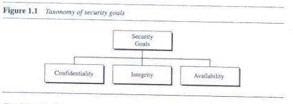
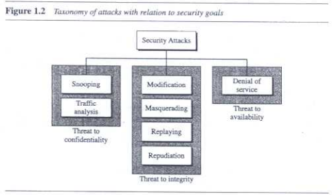
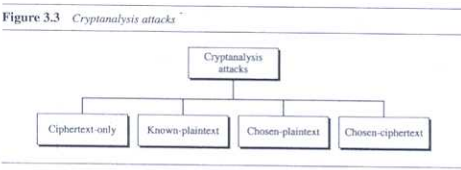
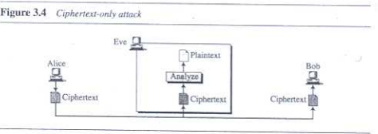
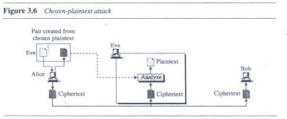
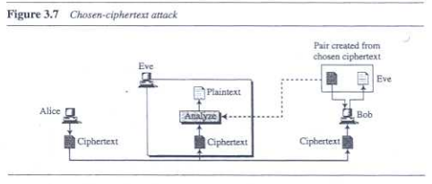
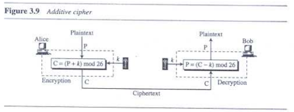

# MODULE 1

## Security Goals

> Confidentiality, Integrity, Availability

### Confidentiality

<b>Confidentiality is maintained by</b>

* Protecting data/information from malicious attackers, when data is stored and when it is transmitted.

### Integrity

<b>Integrity of information means that, the data/information can be changed by authorized persons only.</b>

* In other words _integrity_ also means that the data should be consistent throughout the transaction.

### Availability

**The information stored, should be available to authorized people at any time that they require**
* Unavailability of information is as dangerous as the other 2 security goals.

## Cryptographic Attacks

### Cryptanalytic attacks

* It is practice followed by combining statistical and algebraic techniques to ascertain the key to a cipher.
* The objective of cryptanalysis is to find properties of cipher which does not exist in random function.
* The attacker guesses the key by looking for the distinguishing property in the ciphertext.
* Effiecient attackers use _"Divide and Conquer"_ technique as it reduces the guessing complexity.

### Non-Cryotanalytic Attacks

* These type of attacks, exploit the the 3 security goals, _Confidentiality, Integrity and Availability_.
* These types of attacks are also called as security attacks.

#### Attacks Threatening Confidentiality

* **Snooping**: 
    * Refers to the unathourized access/interception of data.
    * Ex: Accessing and reading a confidential file.
    * Snooping can be prevnted by making the information non-intelligble to the attacker, by using encipherment techniques.
    
* **Traffic Analysis**:
    * Although encipherment hides data from the attacker, the attacker can gain info by tracking the traffic.
    * Ex: They can find email addresses from the sender/reciever by monitoring the traffic.

#### Attacks Threatening Integrity

* **Modification**:
    * After accessing information, the attcker modifies the data to their advantage.
    * Ex: The attacker can intercept a bank transaction to benefit themselves.
    * Sometimes the attacker deletes/delays the information being relayed.

* **Masquerading**: _(Also known as spoofing)_
    * The attacker impersonates somebody else.
    * The attacker behaves as the authorized user.
    * Ex: Attacker steals ATM pin and fakes an authorized transaction.

* **Replaying**:
    * The attacker copies transactions being carried out and imitates them to their own benefit.
    * Ex: Attacker copying bank transactiong and replaying it to benefit them.

* **Repudiation**:
    * It's the event where either the sender or receiver (in the communication) is the attaceker.
    * The sender might deny sending the message or the receiver might deny receiving the message.

#### Attacks Threatening Availability

* **Denial of Service**:
    * The attacker sends multiple bogus requests to the server and the server crashes.
    * The attacker might intercept a server's response to a client and delete it. And client keeps sending requests overloading the server.

#### Passive VS Active attacks

* **Passive attacks**:
    * The attacker's aim is to only obtain information, there is no intent of harming the system or modifying the data.
    * Ex: Snooping, Traffic analysis.

* **Active attacks**:
    * An active attack changes the data and harms the system.
    * Attacks that threaten integrity and availability are called active attacks.
    * Active attacks are easier to detect than prevent.

## Kerckhoff's Principle

> This principle assumes that the adversary knows the encryption/decryption algorithm

* The resistance of the cipher to attack must always be based on the secrecy of the key.

## Cryptanalysis

> It is the science of breaking secret cryptographic codes, to find vulnerabilities.

There are 4 main types of Cryptanalytic attacks.

### Ciphertext-Only Attack

* Assuming the adversary knows the cipher text and the algorithm.
* The attacker will try to get plain text from the cipher text.

### Brute-Force Attack

* Assuming that the attacker knows the algorithm and the and knows the key domain.
* In this method, the attacket tries to use all possible keys to get the plain text from the cipher text.
* To prevent this, the number of possible keys must be very large.

### Statistical Attack

* Using logic and assumptions to break the cipher text. (Ex: The letter 'E' is used most number of times in a plain text)
* To prevent these kinds of attacks the cipher should hide the characteristics of the language.

### Pattern Attack

* While hiding the characteristics of a language the cipher may create patterns, these patterns can be used to break the cipher.
* To avoid this, the cipher must make the cipher text look as random as possible.

### Known-Plaintext Attack

* The attacker has both cipher text and plaintext pair with them, this is then used to break the next intercepted cipher texts.
* To avoid this, it is better to change the key of the cipher.

### Chosen-Plaintext Attack

* Similar to _Known-Plaintext Attack_, but the attacker chooses the plaintext/ciphertext pair.
* This attack is less likely to happen.

### Chosen-Ciphertext Attack

* Same as _Chose-Ciphertext Attack_, but attacker intercepts ciphertexts, decrypts it and then uses this plaintext/ciphertext pair.

## Substitution Ciphers

>Replacing of 1 symbol with another.

### Monoalphabetic Ciphers

>A Character in plaintext is always substituted for another same character.

* Ex: if a letter _'A'_ is changed to _'D'_, every letter _'A'_ in the plaintext is always changed to _'D'_.

#### Additive Cipher / Ceasar Cipher

* The cipher contains a numneric key, and this key is added to the alphabet to get the cipher alphabet.
* Ex: A = 00, key = 4, A + key = 4 = D.

### Polyalphabetic Ciphers

