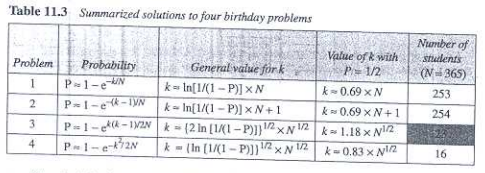

# Module 3

## Hash Functions Based on Block Ciphers
### Rabin Scheme
### Davies - Meyer Scheme
### Matyas - Meyer - Oseas Scheme
### Miyaguchi - Preneel Scheme

## Message Authentication Code - page 297
### MAC
### Nested MAC
### HMAC
### CMAC

## Birthday Attacks

>The birthday problem refers to the counterintuitive probability phenomenon where the likelihood of two people sharing the same birthday in a relatively small group is surprisingly high.

* In Random Oracle Model of hashing, if there is a very large hash table already existing mapped to some values, the probability that a unique hash value will be generated by Random Oracle model decreases.

Here is the extracted text from the image:

---

**Description of Problems**

Below the birthday problems are described in terms that can be applied to the security of hash functions. Note that the term *likely* in all cases means with the probability P ≥ 1/2.

**Problem 1**: What is the minimum number, \( k \), of students in a classroom such that it is likely that at least one student has a predefined birthday? This problem can be generalized as follows. We have a uniformly distributed random variable with \( N \) possible values (between 0 and \( N - 1 \)). What is the minimum number of instances, \( k \), such that it is likely that at least one instance is equal to a predefined value?

**Problem 2**: What is the minimum number, \( k \), of students in a classroom such that it is likely that at least one student has the same birthday as the student selected by the professor? This problem can be generalized as follows. We have a uniformly distributed random variable with \( N \) possible values (between 0 and \( N - 1 \)). What is the minimum number of instances, \( k \), such that it is likely that at least one instance is equal to the selected one?

**Problem 3**: What is the minimum number, \( k \), of students in a classroom such that it is likely that at least two students have the same birthday? This problem can be generalized as follows. We have a uniformly distributed random variable with \( N \) possible values (between 0 and \( N - 1 \)). What is the minimum number of instances, \( k \), such that it is likely that at least two instances are equal?

**Problem 4**: We have two classes, each with \( k \) students. What is the minimum value of \( k \) so that it is likely that at least one student from the first classroom has the same birthday as a student from the second classroom? This problem can be generalized as follows. We have a uniformly distributed random variable with \( N \) possible values (between 0 and \( N - 1 \)). We generate two sets of random values each with \( k \) instances. What is the minimum number of \( k \), such that it is likely that at least one instance from the first set is equal to one instance in the second set?

## Entity Authentication - page 371
### Data Origin VS Entity Authentication
### Verification Categories 