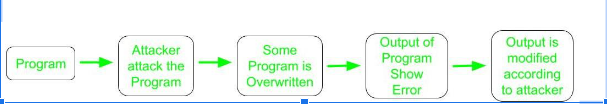

# Define cybersecurity? Bring out its importance.

* Definition 1: The prevention of damage to, protection of, and restoration of computers, electronic communications systems, electronic communications services, wire communication, and electronic communication, including information contained therein, to ensure its availability, integrity, authentications, confidentiality, and nonrepudiation.
* Definition 2: The process of protecting information by preventing, detecting and responding to attacks.
* Definition 3: Ability to protect or defend the use of cyberspace from cyber-attacks. 
* Definition 4: The prevention of damage to, unauthorized use of, exploitation of, and – if needed – the restoration of electronic information and communications systems and the information they contain, in order to strengthen the confidentiality, integrity, and availability of these systems.

**Why is cyber security important?**

- Cyber security is necessary since it helps in securing data from threats such as data theft or misuse, also safeguards your system from viruses.
- We all live in a world which is networked together, from internet banking to government infrastructure, where data is stored on computers and other devices. A portion of that data can be sensitive information, whether that be intellectual property, financial data, personal information, or other types of data for which unauthorized access or exposure could have negative consequences.

# Explain NIST Risk management framework.

>Elaborate in your own words

### NIST

**Prepare**  
Essential activities to prepare the organization to manage security and privacy risks

**Categorize**  
Categorize the system and information processed, stored, and transmitted based on an impact analysis

**Select**  
Select the set of NIST SP 800-53 controls to protect the system based on risk assessment(s)

**Implement**  
Implement the controls and document how controls are deployed

**Assess**  
Assess to determine if the controls are in place, operating as intended, and producing the desired results

**Authorize**  
Senior official makes a risk-based decision to authorize the system (to operate)

**Monitor**  
Continuously monitor control implementation and risks to the system

# Explain DFIR framework.

>Elaborate in your own words

The **Digital Forensics and Incident Response (DFIR) Framework** outlines a structured approach for managing and responding to cyber incidents. Here is a brief explanation of each phase:

- **Routine (A)**: Regular activities and baseline operations to ensure normal functionality and security posture.
- **Initial Identification and Reporting (B)**: Detecting and reporting potential incidents through monitoring and alert systems.
- **Event Handling (C)**: Immediate actions taken to contain and mitigate the impact of the detected event.
- **Cyber Incident Analysis and Response (D)**: In-depth investigation and response to understand the scope, impact, and root cause of the incident, and to remediate the issue.
- **End of Cyber Incident (E)**: Conclusion of the active incident response efforts and restoration of normal operations.
- **Post Incident (F)**: Post-incident activities, including debriefing, reporting, and implementing lessons learned to improve future responses.

# Explain data privacy and data protection.

### Data Privacy and Data Protection

The **Microsoft-drafted Model Privacy Bill (the Model Bill)** serves as a benchmark in the data privacy arena. According to the Federal Information Processing Standards (FIPS), organizations that have matured in privacy practices must provide a "privacy notice" before collecting "personally identifiable information" (PII).

#### Privacy Notice

Providing a privacy notice is crucial as it entitles the organization to use or disclose the information for a secondary purpose. 

From a privacy perspective, there are two kinds of information about individuals:
1. **Aggregated Information**: Data that has been compiled into summaries or reports, which do not identify specific individuals.
2. **Personally Identifiable Information (PII)**: Information that can be used to identify an individual, such as:
   - Name
   - Social Security Number (SSN)
   - Biometrics (fingerprints, facial recognition, etc.)

The provision of a privacy notice ensures transparency and compliance with privacy regulations, allowing individuals to understand how their data will be used and protected.

# List spam and anti-spam laws.

### Spam laws

>The Microsoft checklist features effective anti-Spam legislation and is considered as the benchmark legislation: 

* Envisages an “Opt-Out” anti-Spam regime to address commercial electronic messages.

* Mentions that transactional or relationship messages to customers should be excluded from the scope of regulation.

* It contains the usual restrictions on transmitting electronic messages of commercial nature.

* Mentions that customers should be able to Opt-Out from the receipt of commercial electronic messages on a product-line.

* It does not contemplate any “ADV” or other labeling requirement. 

### Anti spam laws

>Anti-Spam Laws in Canada
* In early 2009, the Canadian Government tabled anti-Spam legislation, Bill C-27, The Electronic Commerce Protection Act, to address Spam, counterfeit websites and Spyware. 

* Amendment to Canada’s Personal Information Protection and Electronic Documents Act (PIPEDA) 

* Two laws currently being discussed in Canadian legislative assemblies: 
    * Senate Bill S-220 and
    * Parliamentary Bill C-27 

# List the various wired and wireless security issues.

### Wired Security Issues:
* Firewalls
* Intrusion Detection, 
* Intrusion Prevention Systems
* Honeypots
* DoS and DDOS attack
### Wireless Security issues- 
* Android and iOS Security
* App Security
* Secure Boot
* Data Exfiltration
* Wireless Protected Access (WPA)
* IEEE 802.1x, 802.11i/ WPA2
* Wireless Network Threats
* Cloud and IoT Application Security

# What is firewall. Explain different types of firewall.

>A network firewall is a system or a group of systems used to control access between 2 networks - a trusted network and an untrusted network, using preconfigured rules and filters

* A firewall is a security system that monitors and controls incoming and outgoing network traffic based on predetermined security rules. It acts as a barrier between a trusted internal network and untrusted external networks, such as the internet. Firewalls can be hardware-based, software-based, or a combination of both, and they are essential for protecting networks from unauthorized access, cyber-attacks, and various types of malware.

### Types of firewalls

#### Packet-Filtering Firewalls:
Examine isolated packets and decide based on source and destination addresses, ports, or protocols.
Operate at the network layer of the OSI model.

#### Stateful Inspection Firewalls:
Monitor the state of active connections and make decisions based on the context of the traffic.
Operate at the network layer but maintain state information.

#### Proxy Firewalls:
Act as intermediaries between end users and the services they access.
Inspect entire messages, not just individual packets, providing higher security.
Operate at the application layer of the OSI model.

#### Next-Generation Firewalls (NGFW):
Combine traditional firewall functions with advanced features such as intrusion prevention, deep packet inspection, and application awareness.
Can operate at multiple layers of the OSI model.

#### Network Address Translation (NAT) Firewalls:
Hide internal network addresses by translating them into a single public IP address.
Provide an additional layer of security by making internal systems invisible to the outside world.

# Explain intrusion detection and prevention system.

* Intrusion Detection Systems (IDS) are security solutions used to detect unauthorized access or abnormal behavior within a network or computer system. These systems monitor network traffic and system activities for malicious actions or policy violations. 
* For example, analyzing network logs for Security Threats

### Classification

* Network-based IDS (NIDS): Monitors network traffic for suspicious activity. It typically examines packet data flowing through the network and looks for patterns that match known attack signatures or anomalies compared to normal traffic.
* Host-based IDS (HIDS): Monitors the activities on a specific host or device. It analyzes system logs, file integrity, and other host-specific data to detect signs of intrusion or unusual behavior.
* Signature-based Detection: Compares monitored activities against a database of known attack patterns or signatures. It is effective against known threats but may struggle with new or unknown attacks.
* Anomaly-based Detection: Establishes a baseline of normal behavior and monitors for deviations from this baseline. This method can detect unknown or novel attacks but may produce false positives if the baseline is not well-defined.
* Hybrid Detection: Combines both signature-based and anomaly-based methods to leverage the strengths of each approach and provide more comprehensive detection capabilities.

### Modes

* Passive IDS: Detects and logs suspicious activity but does not take any action to stop it.
* Active IDS (Intrusion Prevention System, IPS): Detects suspicious activity and takes proactive steps to block or mitigate the threat, often by reconfiguring network devices or terminating connections.

### Key Components

* Sensors: Collect data from network traffic, host logs, or other sources.
* Analyzers: Process and analyze the collected data to identify potential threats.
* User Interface: Provides administrators with alerts, logs, and tools for managing and responding to detected incidents

# Define Honeypot. Explain the uses of Honeypots.

* A honeypot is a security mechanism designed to detect, deflect, or study attempts at unauthorized use of information systems. It acts as a decoy to attract attackers and gather information about their activities. 
* Honeypots are used to observe and analyze the behavior of attackers, identify their techniques, and gather intelligence that can be used to improve overall security measures.

### Types

* Low-Interaction Honeypots: Simulate certain services and responses to attract attackers but have limited interaction capabilities. They are easier to set up and maintain but provide less detailed information.
* High-Interaction Honeypots: Simulate real systems with full interaction capabilities, allowing attackers to interact with the system as if it were a real target. These provide more detailed information but are more complex and risky to maintain.

### Uses of Honeypots in Cybersecurity

**Honeypots** are decoy systems or resources used in cybersecurity to attract, detect, and analyze malicious activity. Here are some key uses of honeypots:

1. **Threat Detection**:
   - **Early Warning System**: Honeypots can act as early warning systems by attracting attackers, thereby alerting security teams to potential threats before they can cause significant harm to actual systems.
   - **Identification of New Threats**: They help in identifying new and emerging threats, including malware, attack vectors, and tactics used by attackers.

2. **Incident Response and Analysis**:
   - **Forensic Analysis**: Honeypots capture detailed information about the attacker's actions, tools, and techniques, which can be used for forensic analysis.
   - **Understanding Attack Patterns**: By analyzing interactions with honeypots, security teams can understand the patterns and methodologies used by attackers, aiding in the development of better defense strategies.

3. **Diversion and Deception**:
   - **Decoy Systems**: Honeypots divert attackers away from valuable assets, leading them to less critical systems where their actions can be monitored without risk to the actual network.
   - **Deception**: They can be used to deceive attackers into thinking they have gained access to valuable data or systems, wasting their time and resources.

4. **Vulnerability Assessment**:
   - **Identifying Weaknesses**: Honeypots can help identify vulnerabilities in the network or applications that are being exploited by attackers.
   - **Testing Security Measures**: They can be used to test the effectiveness of security measures and controls in a safe environment without risking real systems.

5. **Research and Development**:
   - **Security Research**: Honeypots provide valuable data for security researchers studying attacker behavior and developing new security technologies and methods.
   - **Developing Countermeasures**: Information gathered from honeypots can be used to develop and implement effective countermeasures against known threats.

6. **Compliance and Reporting**:
   - **Regulatory Compliance**: Deploying honeypots can help organizations meet regulatory requirements for monitoring and reporting security incidents.
   - **Audit Trails**: They provide detailed logs and audit trails of malicious activities, which can be useful for compliance and reporting purposes.

7. **Training and Awareness**:
   - **Security Training**: Honeypots can be used in training scenarios to educate security professionals about attack techniques and defense strategies.
   - **Raising Awareness**: They can help raise awareness within an organization about the types of threats and attacks that are targeting their systems.

# What is data exfiltration explain the 2 ways that it occurs.

* Data exfiltration typically involves a cybercriminal stealing data from personal or corporate devices, such as computers and mobile phones, through various cyberattack methods. 
* A common data exfiltration definition is the theft or unauthorized removal or movement of any data from a device.

>Data exfiltration occurs in two ways, 
* Through outsider attacks 
* Via insider threats. 
>Both are major risks, and organizations must ensure their data is protected by always detecting and preventing data exfiltration.
Attacks such as
* Cyber criminal injecting malware onto a device, such as a computer or smartphone, that is connected to a corporate network. 
* Malicious insiders stealing their own organization’s data and sending documents to their personal email addresses or cloud storage services, potentially to sell to cybercriminals.
* Can also be caused by careless employee behavior that sees corporate data fall into the hands of bad actors.                

# What is cloud security. explain it in brief.

* It protects your information against threats, either internal or external.
* Effective Cloud Security demands the hard work and efforts of every other person present in the company along with cloud providers and the customers that are using them.

### Cloud Security comprises of 

* Data security
* IAM (Identity and access management)
* Governance (guidelines available on threat prevention, recognition, and mitigation)
* Data retention and business continuity planning(DR/BC)
* Legal compliance

### What Exactly Does Cloud Security Protect?
* Physical equipment required in networking, such as routers and cabling
* Operating systems
* Data servers
* Computing software used as a core of online networking
* Hard drives
* Computer virtualization frameworks, including both host and guest machines
* Runtime environments or running program
* Data (stored or modified)
* Applications
* E-mails
* End-user hardware such as PCs, smartphones, Internet of Things (IoT) devices, modems.

# List the different web security threats and explain SQL injection attack.

### Threats to Web Security
* SQL injection
* Cross-site scripting
* Remote file inclusion
* Password breach
* Data breach
* Code injection

An SQL injection (SQLi) attack is a type of security vulnerability that occurs when an attacker manipulates a web application's database query by injecting malicious SQL code. This often happens through input fields like login forms, search bars, or URL parameters where user input is not properly sanitized.

### How It Works:
1. **Input Manipulation**: Attackers exploit vulnerabilities by entering malicious SQL code into input fields. If the application does not validate or sanitize this input, the code is directly incorporated into SQL queries.
2. **Query Execution**: The database executes the injected SQL code, which can result in unintended operations such as unauthorized data retrieval, data modification, or even deletion.

### Potential Consequences:
- **Data Breach**: Attackers can gain unauthorized access to sensitive information like usernames, passwords, and personal data.
- **Data Manipulation**: They can alter or delete records, compromising the integrity of the database.
- **Access Control Bypass**: By modifying queries, attackers can bypass authentication mechanisms and gain administrative privileges.
- **Denial of Service**: Malicious queries can overload the database, leading to service disruptions.

# Explain control hijacking.

* Control hijacking attacks are a type of cyber attack where the attacker takes control of a program's execution flow and directs it to malicious code, which can result in a wide range of security issues, system manipulation, and further exploitation.

Control hijacking is a type of cybersecurity attack where an attacker gains control over the execution flow of a program. This can lead to unauthorized actions, including the execution of malicious code. Here are some common types of control hijacking:

### 1. Buffer Overflow
**Description**: Buffer overflow occurs when more data is written to a buffer than it can hold. This extra data can overwrite adjacent memory, including the return address of a function.
**Impact**: This can change the execution flow of the program, allowing attackers to execute arbitrary code.

### 2. Stack Overflow
**Description**: A specific type of buffer overflow that occurs in the call stack, where the return address of a function is overwritten.
**Impact**: When the function returns, it jumps to the address specified by the attacker, potentially executing malicious code.

### 3. Heap Overflow
**Description**: Similar to stack overflow but occurs in the heap memory area. The heap is used for dynamic memory allocation.
**Impact**: Attackers can overwrite function pointers or critical data structures in the heap to change program behavior.

### 4. Format String Attack
**Description**: Occurs when an attacker manipulates the format string parameter in functions like `printf` in C/C++.
**Impact**: This can lead to arbitrary code execution, reading and writing of memory locations, and information leakage.

### 5. Return-Oriented Programming (ROP)
**Description**: A sophisticated form of attack where an attacker uses existing code snippets (gadgets) in the program's memory to create a malicious payload.
**Impact**: ROP bypasses many security mechanisms like non-executable memory by reusing legitimate code.

### 6. Jump-Oriented Programming (JOP)
**Description**: Similar to ROP, but instead of return instructions, it uses jump or call instructions to chain together gadgets.
**Impact**: Provides an alternative way to hijack control flow, particularly useful in environments where ROP mitigations are in place.

### 7. Code Injection
**Description**: The attacker injects malicious code into a running process or executable file.
**Impact**: The injected code is executed with the same privileges as the compromised process, leading to unauthorized actions.

### 8. Integer Overflow
**Description**: Occurs when an arithmetic operation results in a value that exceeds the storage capacity of the integer type.
**Impact**: Can lead to buffer overflows, memory corruption, and control flow hijacking.

### 9. DLL Injection
**Description**: An attacker forces a program to load a malicious dynamic link library (DLL).
**Impact**: The injected DLL executes within the context of the target process, potentially allowing full control over the process.
