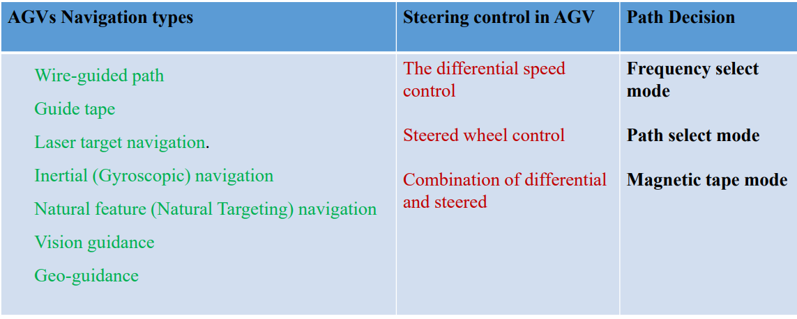
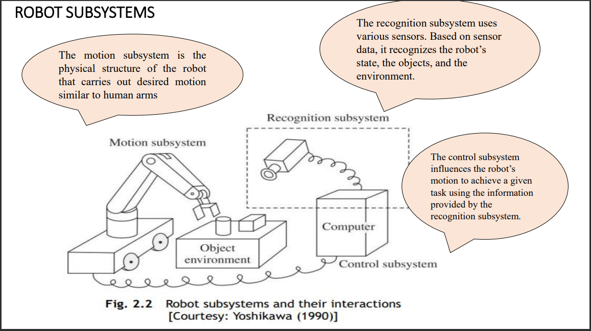
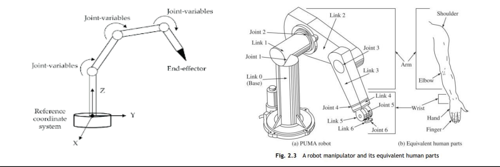
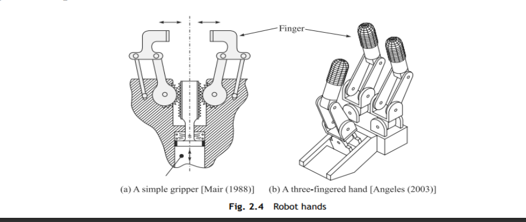
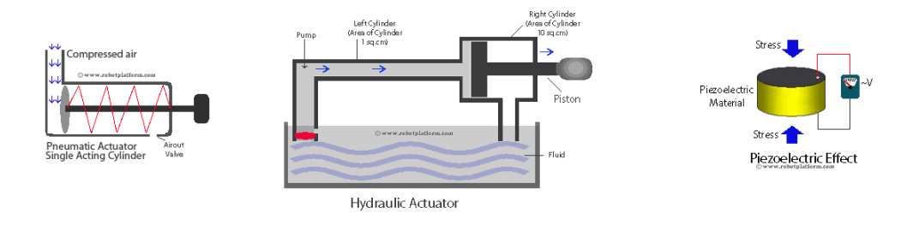
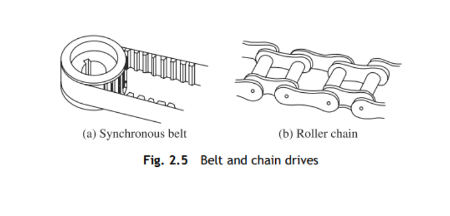
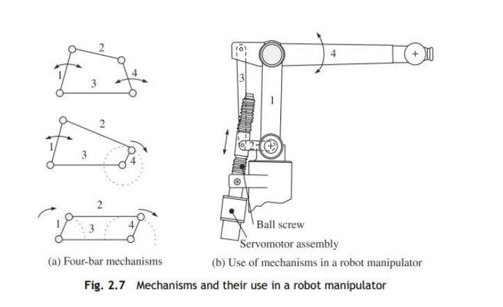

# MODULE 1

## 1. List and explain special purpose robots.

<b><u>ANS</u></b>: 

* Special purpose robots are robots that are used in places other than factories.
* Ex: A serial robot mounted on a spacecraft used for retrieval of a faulty satellite or putting it back after repair can be considered a special-purpose robot.

>Special purpose robots are classified into: Automatic Guided Vehicles, Walking robots, Parallel robots

### Automatic Guided Vehicles:
* These are mobile robotic systems commonly used in factories for material-handling purposes.
    

### Walking Robots

* They are a type of mobile robot which use articulated limbs, such as leg mechanisms, to provide locomotion.
* They are more versatile than wheeled robots and can traverse many different terrains, though these advantages require increased complexity and power consumption.
* Legged robots often imitate legged animals, such as humans or insects, in an example of biomimicry.
* In order to maintain locomotion the center of gravity of the walker must be supported either statically or dynamically.
* Static support is provided by ensuring the center of gravity is within the support pattern formed by legs in contact with the ground.
* Dynamic support is provided by keeping the trajectory of the center of gravity located so that it can be repositioned by forces from one or more of its legs.
* Legged robots can be categorized by the number of limbs they use, which determines gaits available. 

>Many-legged robots tend to be more stable, while fewer legs lends itself to greater maneuverability.
 
* One-legged: One-legged, or pogo stick robots use a hopping motion for navigation. In the 1980s, Carnegie Mellon University developed a one-legged robot to study balance. Berkeley’s SALTO is another example.
* Bipedal or two-legged robots exhibit bipedal motion. As such, they face two primary problems: Stability Control, which refers to a robot's balance and Motion Control, which refers to a robot's ability to move.
    * Stability control is particularly difficult for bipedal systems, which must maintain balance in the forward-backward direction even at rest. Some robots, especially toys, solve this problem with large feet, which provide greater stability while reducing mobility.
    * Alternatively, more advanced systems use sensors such as accelerometers or gyroscopes to provide dynamic feedback in a fashion that approximates a human being's balance.

### Parallel Robots

* As the name suggests, these robots have parallel configuration, in contrast to the serial-like structure of an industrial robot.
* A parallel robot is composed of a mobile platform connected to a fixed base by a set of identical parallel kinematic chains, which are called legs. The end-effector is fixed to the mobile platform.
* It has six legs to control the moving platform. It is also used as a driving simulator for truck and other types of ground vehicles.
* Such robots find applications in machine tools and medical surgery to reduce the
trembling of a surgeon’s hand during operation, etc.

## 2. Explain the Safety guidelines in Robot deployment.

<b><u>ANS</u></b>:

### The following guidelines help to remove hazardous situations to robot personnel, factory workers, visitors, and to the robot itself:

* The robot working area should be closed by permanent barriers (e.g., fences, rolls, and chains) to prevent people from entering the area while the robot is working.
* Access gates to the closed working area of the robot should be interlocked with the robot control.
* An illuminated working sign, stating ‘robot at work’, should be automatically turned on when the robot is switched on.
* Emergency stop buttons must be provided in easily accessible locations as well as on the robot’s teach box and control console.
* Pressure-sensitive pads can be put on the floor around the robot that, when stepped on, turn the robot controller off .
* Emphasize safety practices during robot maintenance.
* Great care must be taken during programming with the manual reaching mode.
* The robot’s electrical and hydraulic installation should meet proper standards
* Power cables and signal wires must not create hazards if they are accidentally cut during the operation of the robot.
* Mechanical stoppers, interlocks, and sensors can be added to limit the robot’s reach envelope when the maximum range is not required.

## 3. State the important consideration for Robot Installation

<b><u>ANS</u></b>:

### Price of a Robot

* Usually, higher priced robots are capable of more demanding jobs and their control sophistication assures that they can be adapted to new jobs when original assignments are completed.
* The more expensive and more sophisticated robot will normally require less special tooling and lower installation cost.
* A robot may contribute over 20% of the total system automation cost.

### Special Tooling

* Special tooling may include an indexing conveyor, weld guns, transformers, clamps, and a supervisory computer for a complex task of robots involved in spot welding of car bodies.
* For assembly automation, the special parts may cost well in excess of the robot equipment cost.

### Installation Cost

* Installation cost is sometimes charged fully to a robot project, but is often carried as overhead because plant layout may change.
* As a model changes, there are usually installation costs to be absorbed even if equipment is to be manually operated.
* There is no logic to penalising the robot installation for any more than a differential cost which is
inherent in the robotizing process

### Maintenance

* To keep the functioning of a robot proper, there is a need for regular maintenance, a periodic need for more sweeping overhaul, and a random need to correct unscheduled downtime incidents.
* A rule of thumb for well-designed production equipment operated in two shifts continually is a total annual cost of about 10% of the purchase price.
* There is a variability of course depending upon the demands of the job and the environment.
* Maintenance costs in a foundry are greater than those experienced in plastic moulding.

### Operating Power: 
* Operating power is easily calculated as the product of overall power drain and the hours worked. 

### Finance: 

* In some cost-justification formulae, one takes into account the current cost of money. 
* In others, one uses an expected return on investment to establish economic viability.

### Depreciation :

* Robots, like any other equipment, will exhibit a useful life and it is ordinary practice to depreciate the investment over this useful life.
* Since a robot tends to be a general-purpose equipment, there is ample evidence that an 8 to 10 years life running multi-shift is a conservative treatment.

### Enhanced Productivity

* The prime issue in justifying a robot is increased productivity. 
* Industries are interested in shielding workers from hazardous working conditions, but the key motivator is the increased productivity by introducing a robot that can operate for more than one shift continuously and thereby multiply the production rate.

### Improved Quality

* If a job is in a hazardous environment, or is physically demanding, or is simply mind-numbing, there is a good chance that product quality will suffer according to the mood of a human worker.
* A robot may well be more consistent on the job and, therefore, it may produce a higher quality output.

## 4. List the Thumb Rules on the decision of Robot Usage.

<b><u>ANS</u></b>:

### Thumb Rules on the Decision of Robot Usage 
* The first rule to consider is known as Four D’s of Robotics, i.e., is the task dirty, dull, dangerous, or difficult? If so, a human will probably not be able to do the job efficiently for hours. Therefore, the job is appropriate for automation or robotic labor.
* The second rule is that a robot may not leave a human jobless. Robotics and automation must serve to make our lives more enjoyable, not miserable.
* A third rule involves asking whether you can find people who are willing to do the job. If not, the job is a candidate for automation or robotics. Indeed this should be a primary reason for the growth of automation and robotics.
* A fourth rule of thumb is that the use of robots or automation must make short term and long-term economic sense.

## 5. Explain the components of a Robot and illustrate the working of a typical Robot.

<b><u>ANS</u></b>:

### Control System

* Computation includes all of the components that make up a robot’s central processing unit, often referred to as its control system.
* Control systems are programmed to tell a robot how to utilize its specific components, similar in some ways to how the human brain sends signals throughout the body, in order to complete a specific task.
* These robotic tasks could comprise anything from minimally invasive surgery to assembly line packing.

### Sensors

* Sensors provide a robot with stimuli in the form of electrical signals that are processed by the controller and allow the robot to interact with the outside world.
* Common sensors found within robots include video cameras that function as eyes, photoresistors that react to light and microphones that operate like ears.
* These sensors allow the robot to capture its surroundings and process the most logical conclusion based on the current moment and allows the controller to relay commands to the additional components.

### Actuators

* A device can only be considered to be a robot if it has a movable frame or body. Actuators are the components that are responsible for this movement.
* These components are made up of motors that receive signals from the control system and move in tandem to carry out the movement necessary to complete the assigned task.
* Actuators can be made of a variety of materials, such as metal or elastic, and are commonly operated by use of compressed air (pneumatic actuators) or oil (hydraulic actuators) but come in a variety of formats to best fulfill their specialized roles.

### Power Supply

* Like the human body requires food in order to function, robots require power. Stationary robots, such as those found in a factory, may run on AC power through a wall outlet but more commonly, robots operate via an internal battery.
* Most robots utilize lead-acid batteries for their safe qualities and long shelf life while others may utilize the more compact but also more expensive silver-cadmium variety.
* Safety, weight, replaceability and lifecycle are all important factors to consider when designing a robot’s power supply.

### End Effectors

* End effectors are the physical, typically external components that allow robots to finish carrying out their tasks.
* Robots in factories often have interchangeable tools like paint sprayers and drills, surgical robots may be equipped with scalpels and other kinds of robots can be built with gripping claws or even hands for tasks like deliveries, packing, bomb diffusion and much more.

## 6. Explain the Motion Subsystem of Robot.

* The elements of the motion subsystem are as follows:
1. Manipulator 
2. End-effector
3. Actuator
4. Transmission

### Manipulator

* This is the physical structure, which moves around. It comprises of links (also referred as bodies) and joints (also called kinematic pairs) normally connected in series.
* Each link is either made of steel or aluminum. Other materials can also be used depending on the requirements.
* The joints are generally rotary or translatory types. In the study of robotics and mechanisms, these joints are referred to as revolute (Hinges) and prismatic joints (Internal Combustion Engine).
* Like a human arm, wrist, and hand arrangement a robot manipulator has also three parts: The first two, i.e., the arm and wrist, respectively, whereas the third one, i.e., the hand.
* The function of an arm is to place an object in a certain position in the three-dimensional Cartesian space, where the wrist orients it.
* For a typical six degrees-of-freedom (DOF) robot,, the first three links and joints form the arm, and the last three mutually intersecting joints make the wrist.

### End-effector

* This is the part attached at the end of a robot manipulator.
* This is equivalent to the human hand. An end-effector could be a mechanical hand that manipulates an object or holds it before they are moved by the robot arm.
* The specialized tools like welding electrode, gas-cutting torch, painting brush, debarring tool, or grinding wheel attached to the end of a manipulator arm to perform specific tasks, are also considered end-effectors.

### Actuator

* The actuators of a robot actually provide motion to the manipulator links and the end-effecter
* They are classified as pneumatic, hydraulic, or electric, based on their principle of operation.
* Note here that an electric motor, e.g., dc or ac, when coupled to motion transmission elements, e.g., gears, etc., is called an actuator.
* A pneumatic or a hydraulic system which can directly impart motions to the robot links and the end-effectors is called an actuator, not motor.

### Transmission

* These elements transmit motion from the electric motors and pneumatic/hydraulic actuators to the actual links of the manipulator
* With electric motors these elements, mainly, the gears, are used to step down the speed. Note that electric motors are efficient at higher speeds
* The transmission gears are used to reduce the speed of the electric motors.
* Typical transmission elements are the following:
    1. Belt and Chain Drives
    2. Gears
    3. Link Mechanisms
    4. Screw Mechanism

#### Belt and Chain Drives: 

* Belt drives are widely used in robotics, particularly, the synchronous belt shown in Fig. 2.5(a).However, their life is short as they rely on belt tension to produce grip over the pulley.
* Chains drives shown in Fig. 2.5(b) are generally cheaper. They have higher load capacities and service lives compared to belt drives, but lower in relation to the gears.

#### Gears

* Gears Of all mechanical transmissions, gears shown in Fig. 2.6 are the most long-lasting and reliable, although their backlash must be carefully taken into account during the design stage.

#### Link Mechanisms

* Link Mechanisms: In order to reduce the flexibility and weight of the above transmission elements, link mechanisms shown in Fig. 2.7(a) are used.

#### Screw Mechanisms

* Screw Mechanism: Figure 2.7(b) shows how ball-screws with a four-bar mechanism (indicated with 1, 2, 3 and 4) bars are used to transmit motion.

