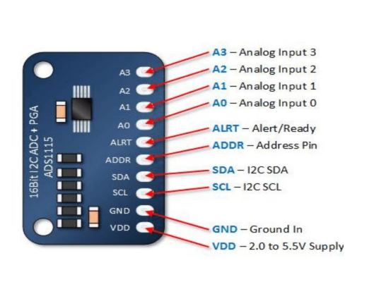
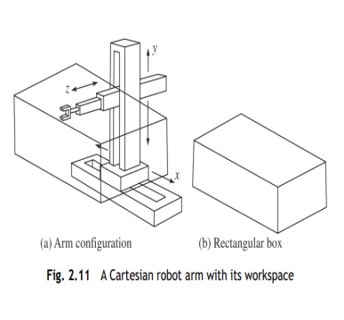
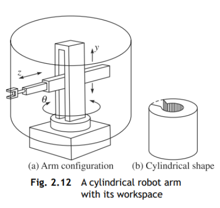
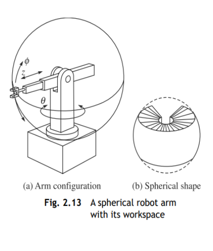
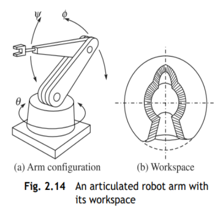
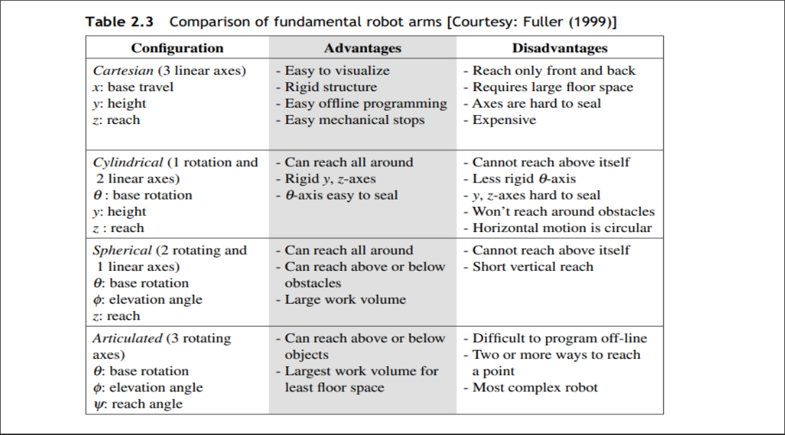

# MODULE 1

## 1. List and explain special purpose robots.

<b><u>ANS</u></b>: 

* Special purpose robots are robots that are used in places other than factories.
* Ex: A serial robot mounted on a spacecraft used for retrieval of a faulty satellite or putting it back after repair can be considered a special-purpose robot.

>Special purpose robots are classified into: Automatic Guided Vehicles, Walking robots, Parallel robots

### Automatic Guided Vehicles:
* These are mobile robotic systems commonly used in factories for material-handling purposes.
    

### Walking Robots

* They are a type of mobile robot which use articulated limbs, such as leg mechanisms, to provide locomotion.
* They are more versatile than wheeled robots and can traverse many different terrains, though these advantages require increased complexity and power consumption.
* Legged robots often imitate legged animals, such as humans or insects, in an example of biomimicry.
* In order to maintain locomotion the center of gravity of the walker must be supported either statically or dynamically.
* Static support is provided by ensuring the center of gravity is within the support pattern formed by legs in contact with the ground.
* Dynamic support is provided by keeping the trajectory of the center of gravity located so that it can be repositioned by forces from one or more of its legs.
* Legged robots can be categorized by the number of limbs they use, which determines gaits available. 

>Many-legged robots tend to be more stable, while fewer legs lends itself to greater maneuverability.
 
* One-legged: One-legged, or pogo stick robots use a hopping motion for navigation. In the 1980s, Carnegie Mellon University developed a one-legged robot to study balance. Berkeley’s SALTO is another example.
* Bipedal or two-legged robots exhibit bipedal motion. As such, they face two primary problems: Stability Control, which refers to a robot's balance and Motion Control, which refers to a robot's ability to move.
    * Stability control is particularly difficult for bipedal systems, which must maintain balance in the forward-backward direction even at rest. Some robots, especially toys, solve this problem with large feet, which provide greater stability while reducing mobility.
    * Alternatively, more advanced systems use sensors such as accelerometers or gyroscopes to provide dynamic feedback in a fashion that approximates a human being's balance.

### Parallel Robots

* As the name suggests, these robots have parallel configuration, in contrast to the serial-like structure of an industrial robot.
* A parallel robot is composed of a mobile platform connected to a fixed base by a set of identical parallel kinematic chains, which are called legs. The end-effector is fixed to the mobile platform.
* It has six legs to control the moving platform. It is also used as a driving simulator for truck and other types of ground vehicles.
* Such robots find applications in machine tools and medical surgery to reduce the
trembling of a surgeon’s hand during operation, etc.

## 2. Explain the Safety guidelines in Robot deployment.

<b><u>ANS</u></b>:

### The following guidelines help to remove hazardous situations to robot personnel, factory workers, visitors, and to the robot itself:

* The robot working area should be closed by permanent barriers (e.g., fences, rolls, and chains) to prevent people from entering the area while the robot is working.
* Access gates to the closed working area of the robot should be interlocked with the robot control.
* An illuminated working sign, stating ‘robot at work’, should be automatically turned on when the robot is switched on.
* Emergency stop buttons must be provided in easily accessible locations as well as on the robot’s teach box and control console.
* Pressure-sensitive pads can be put on the floor around the robot that, when stepped on, turn the robot controller off .
* Emphasize safety practices during robot maintenance.
* Great care must be taken during programming with the manual reaching mode.
* The robot’s electrical and hydraulic installation should meet proper standards
* Power cables and signal wires must not create hazards if they are accidentally cut during the operation of the robot.
* Mechanical stoppers, interlocks, and sensors can be added to limit the robot’s reach envelope when the maximum range is not required.

## 3. State the important consideration for Robot Installation

<b><u>ANS</u></b>:

### Price of a Robot

* Usually, higher priced robots are capable of more demanding jobs and their control sophistication assures that they can be adapted to new jobs when original assignments are completed.
* The more expensive and more sophisticated robot will normally require less special tooling and lower installation cost.
* A robot may contribute over 20% of the total system automation cost.

### Special Tooling

* Special tooling may include an indexing conveyor, weld guns, transformers, clamps, and a supervisory computer for a complex task of robots involved in spot welding of car bodies.
* For assembly automation, the special parts may cost well in excess of the robot equipment cost.

### Installation Cost

* Installation cost is sometimes charged fully to a robot project, but is often carried as overhead because plant layout may change.
* As a model changes, there are usually installation costs to be absorbed even if equipment is to be manually operated.
* There is no logic to penalising the robot installation for any more than a differential cost which is
inherent in the robotizing process

### Maintenance

* To keep the functioning of a robot proper, there is a need for regular maintenance, a periodic need for more sweeping overhaul, and a random need to correct unscheduled downtime incidents.
* A rule of thumb for well-designed production equipment operated in two shifts continually is a total annual cost of about 10% of the purchase price.
* There is a variability of course depending upon the demands of the job and the environment.
* Maintenance costs in a foundry are greater than those experienced in plastic moulding.

### Operating Power: 
* Operating power is easily calculated as the product of overall power drain and the hours worked. 

### Finance: 

* In some cost-justification formulae, one takes into account the current cost of money. 
* In others, one uses an expected return on investment to establish economic viability.

### Depreciation :

* Robots, like any other equipment, will exhibit a useful life and it is ordinary practice to depreciate the investment over this useful life.
* Since a robot tends to be a general-purpose equipment, there is ample evidence that an 8 to 10 years life running multi-shift is a conservative treatment.

### Enhanced Productivity

* The prime issue in justifying a robot is increased productivity. 
* Industries are interested in shielding workers from hazardous working conditions, but the key motivator is the increased productivity by introducing a robot that can operate for more than one shift continuously and thereby multiply the production rate.

### Improved Quality

* If a job is in a hazardous environment, or is physically demanding, or is simply mind-numbing, there is a good chance that product quality will suffer according to the mood of a human worker.
* A robot may well be more consistent on the job and, therefore, it may produce a higher quality output.

## 4. List the Thumb Rules on the decision of Robot Usage.

<b><u>ANS</u></b>:

### Thumb Rules on the Decision of Robot Usage 
* The first rule to consider is known as Four D’s of Robotics, i.e., is the task dirty, dull, dangerous, or difficult? If so, a human will probably not be able to do the job efficiently for hours. Therefore, the job is appropriate for automation or robotic labor.
* The second rule is that a robot may not leave a human jobless. Robotics and automation must serve to make our lives more enjoyable, not miserable.
* A third rule involves asking whether you can find people who are willing to do the job. If not, the job is a candidate for automation or robotics. Indeed this should be a primary reason for the growth of automation and robotics.
* A fourth rule of thumb is that the use of robots or automation must make short term and long-term economic sense.

## 5. Explain the components of a Robot and illustrate the working of a typical Robot.

<b><u>ANS</u></b>:

### Control System

* Computation includes all of the components that make up a robot’s central processing unit, often referred to as its control system.
* Control systems are programmed to tell a robot how to utilize its specific components, similar in some ways to how the human brain sends signals throughout the body, in order to complete a specific task.
* These robotic tasks could comprise anything from minimally invasive surgery to assembly line packing.

### Sensors

* Sensors provide a robot with stimuli in the form of electrical signals that are processed by the controller and allow the robot to interact with the outside world.
* Common sensors found within robots include video cameras that function as eyes, photoresistors that react to light and microphones that operate like ears.
* These sensors allow the robot to capture its surroundings and process the most logical conclusion based on the current moment and allows the controller to relay commands to the additional components.

### Actuators

* A device can only be considered to be a robot if it has a movable frame or body. Actuators are the components that are responsible for this movement.
* These components are made up of motors that receive signals from the control system and move in tandem to carry out the movement necessary to complete the assigned task.
* Actuators can be made of a variety of materials, such as metal or elastic, and are commonly operated by use of compressed air (pneumatic actuators) or oil (hydraulic actuators) but come in a variety of formats to best fulfill their specialized roles.

### Power Supply

* Like the human body requires food in order to function, robots require power. Stationary robots, such as those found in a factory, may run on AC power through a wall outlet but more commonly, robots operate via an internal battery.
* Most robots utilize lead-acid batteries for their safe qualities and long shelf life while others may utilize the more compact but also more expensive silver-cadmium variety.
* Safety, weight, replaceability and lifecycle are all important factors to consider when designing a robot’s power supply.

### End Effectors

* End effectors are the physical, typically external components that allow robots to finish carrying out their tasks.
* Robots in factories often have interchangeable tools like paint sprayers and drills, surgical robots may be equipped with scalpels and other kinds of robots can be built with gripping claws or even hands for tasks like deliveries, packing, bomb diffusion and much more.

## 6. Explain the Motion Subsystem of Robot.

<b><u>ANS</u></b>:

* The elements of the motion subsystem are as follows:
1. Manipulator 
2. End-effector
3. Actuator
4. Transmission

### Manipulator

* This is the physical structure, which moves around. It comprises of links (also referred as bodies) and joints (also called kinematic pairs) normally connected in series.
* Each link is either made of steel or aluminum. Other materials can also be used depending on the requirements.
* The joints are generally rotary or translatory types. In the study of robotics and mechanisms, these joints are referred to as revolute (Hinges) and prismatic joints (Internal Combustion Engine).
* Like a human arm, wrist, and hand arrangement a robot manipulator has also three parts: The first two, i.e., the arm and wrist, respectively, whereas the third one, i.e., the hand.
* The function of an arm is to place an object in a certain position in the three-dimensional Cartesian space, where the wrist orients it.
* For a typical six degrees-of-freedom (DOF) robot,, the first three links and joints form the arm, and the last three mutually intersecting joints make the wrist.

### End-effector

* This is the part attached at the end of a robot manipulator.
* This is equivalent to the human hand. An end-effector could be a mechanical hand that manipulates an object or holds it before they are moved by the robot arm.
* The specialized tools like welding electrode, gas-cutting torch, painting brush, debarring tool, or grinding wheel attached to the end of a manipulator arm to perform specific tasks, are also considered end-effectors.

### Actuator

* The actuators of a robot actually provide motion to the manipulator links and the end-effecter
* They are classified as pneumatic, hydraulic, or electric, based on their principle of operation.
* Note here that an electric motor, e.g., dc or ac, when coupled to motion transmission elements, e.g., gears, etc., is called an actuator.
* A pneumatic or a hydraulic system which can directly impart motions to the robot links and the end-effectors is called an actuator, not motor.

### Transmission

* These elements transmit motion from the electric motors and pneumatic/hydraulic actuators to the actual links of the manipulator
* With electric motors these elements, mainly, the gears, are used to step down the speed. Note that electric motors are efficient at higher speeds
* The transmission gears are used to reduce the speed of the electric motors.
* Typical transmission elements are the following:
    1. Belt and Chain Drives
    2. Gears
    3. Link Mechanisms
    4. Screw Mechanism

#### Belt and Chain Drives: 

* Belt drives are widely used in robotics, particularly, the synchronous belt shown in Fig. 2.5(a).However, their life is short as they rely on belt tension to produce grip over the pulley.
* Chains drives shown in Fig. 2.5(b) are generally cheaper. They have higher load capacities and service lives compared to belt drives, but lower in relation to the gears.

#### Gears

* Gears Of all mechanical transmissions, gears shown in Fig. 2.6 are the most long-lasting and reliable, although their backlash must be carefully taken into account during the design stage.

#### Link Mechanisms

* Link Mechanisms: In order to reduce the flexibility and weight of the above transmission elements, link mechanisms shown in Fig. 2.7(a) are used.

#### Screw Mechanisms

* Screw Mechanism: Figure 2.7(b) shows how ball-screws with a four-bar mechanism (indicated with 1, 2, 3 and 4) bars are used to transmit motion.

## 7. Explain the Recognition and Control Subsystem of Robot.

<b><u>ANS</u></b>:

### Two important component of Recognition System are
* Sensors: Sensors fall into one of the several general areas: vision, touch, range and proximity detection,
navigation, speech recognition.
* Analog-to-Digital Converter (ADC): This device converts analog data fetched from pressure, audio, and temperature sensors into digital signals.

### Control Subsystem

Two major Components of a control subsystem are: 
1. Digital Controller
2. Digital-to-Analog Converter ( DAC)
3. Amplifier

* The digital controller is a special electronic device that has a CPU, memory, and sometimes hard disk to store programmed data.
* In robotic systems, these components are kept inside a box referred as a controller.
* It is used to control the movement of the manipulator and end-effecter.
* A controller processes the user-programmed commands and sends signals to the actuators through the Digital-to-Analog Converters (DAC). The programming languages can be same as computers, i.e., BASIC, Fortran, C, and C++.
* This is mainly to introduce specific features into the robotic systems so that the products are different.
A Digital-to-Analog Converter, or DAC, converts the digital signal from the robot controller to an analog signal to activate the actuators.

In, order to actually drive the actuators, e.g., a dc electric motor, the digital controller is
coupled with a DAC to convert its signal back to an equivalent analogue signal, e.g., the
electric voltage for the dc motor.

* Amplifier : Since the control commands from the digital controller converted to
analog signals by the DAC are very weak, they need to be amplified to drive, e.g., the
electric motors of the robot manipulator.

## 8. Explain in details classification of Robots based on the Co-ordinate System.

<b><u>ANS</u></b>:

There are several ways to classify a robot,

* based on a coordinate system, i.e., Cartesian or cylindrical, etc., 
    1. Cartesian
    2. Cylindrical
    3. Spherical or Polar

* based on its applications or Control of a robot i.e., assembling or 
welding, etc

### Cartesian Robot

* When a robot’s arm moves in a rectilinear mode, that is, to the directions of the rectangular right-handed Cartesian coordinate system's x, y, and z coordinates.
* The movements are called travel x, height or elevation y, and reach z of the arm.
* A Cartesian robot needs a large volume to operate. It has, however, a rigid structure and provides an accurate position of the end-effecter.
* Maintenance of such robots is difficult, as the rectilinear motions are generally obtained through the sets of rotary electric actuators coupled with nut-and-ball screws.
* Dust accumulated on the screws may jam the smooth motion of the robot. Hence, they have to be covered with bellows.
* Moreover, maintaining the straightness of the screw demands higher rigidity in those components. Hence, such robots tend to be more expensive.

### Cylindrical

* When the arm of a robot possesses one revolute and two prismatic joints.
* The first prismatic joint of the Cartesian type.is replaced by a revolute one with its axis rotated by 90° about the reach z-axis,
*The points that it can reach conveniently be specified by the cylindrical coordinate., i.e., angle θ, height y, and radius z.
* Since the coordinates of the arm can assume values between specified upper and lower limits, its end-effector can move in a limited volume that is a cut section from the space between the two concentric cylinders.
* A robot of this type may have difficulties in touching the floor near the base.
* Cylindrical robots are successfully used when a task requires reaching into small openings or working on cylindrical surfaces, e.g., welding pipes.

### Spherical or Polar

* When the arm of a robot can change its configuration by moving its two revolute joints and one prismatic joint.
* The second prismatic joint along the height y of the cylindrical type is replaced by a revolute joint with its axis rotated by 90° about the reach z-axis, the arm position is conveniently described by means of the spherical coordinates, i.e., θ, φ, and z.
* The arm movements represent the base rotation, elevation angles, and reach, respectively.

### Articulated or Revolute

* When a robot arm consists of links connected by revolute joints only, i.e., the third prismatic joint of the spherical type is also replaced by another revolute joint with its axis rotated by 90° about the q-axis, it is called an articulated or revolute jointed arm.
* Such robots are relatively simple to fabricate and maintain, as the robot’s actuators are directly coupled through a set of rotary gear or belt elements.

## 9. List the laws defined for Robots.

<b><u>ANS</u></b>:

Isaac Asimov in his science-fiction stories during the 1940s envisioned the robot as a helper of
humankind and postulated three basic rules for robots. These are generally known as the ‘ Laws of
Robotics.’

1. A robot must not harm a human being, nor through inaction allow one to come to harm.
2. A robot must always obey human beings, unless that is in conflict with the first law.
3. A robot must protect from harm, unless that is in conflict with the first two laws.

A fourth law was later introduced by Fuller (1999) as
4. A robot may take a human being’s job but it may not leave that person jobless

## 10. Explain the Motion Subsystem of a Robot.

<b><u>ANS</u></b>:

>Same as answer 6

## 11. Compare Industrial and Special Purpose Robots.

<b><u>ANS</u></b>:

* Industrial robots are intended to serve as general-purpose, unskilled or semiskilled
labour, e.g., for welding, painting, machining, etc.

* A special-purpose robot is the one that is used in places other than typical factory environment.

## 12. Explain the following Actuation method: Electric, Fluid and Pneumatic

* Actuators can be made of a variety of materials, such as metal or elastic, and are
commonly operated by use of compressed air (pneumatic actuators) or oil
(hydraulic actuators) but come in a variety of formats to best fulfill their
specialized roles.

## 13. Mention the typical applications of robots and explain any four

>Robots are used in man fields

* Medical 
* Mining
* Space
* Underwater
* Defence
* Security
* Domestic
* Entertainment

### Medical

* Medical robots have found applications mainly in surgery.
* The goal of surgical robotics is not to replace the surgeon with a robot, but to provide the surgeon with a new set of very versatile tools that extend his or her ability to treat patients.
* Medical robot systems are called surgical assistants that work cooperatively with surgeons.
* Currently, there are two main varieties of surgical assistant robots.
1. Surgeon extender.
2. Auxiliary surgical support

#### Surgical assistants:
• These robots augments the surgeon’s ability to manipulate surgical instruments during surgery.
• This eliminates hand tremor or the ability to perform dexterous operations inside the patient’s body. As a result, casualty rates are reduced, and operative times are shortened.

#### Auxiliary surgical support:
• These robots works side by side with the surgeon and performs functions like holding endoscopes, etc.
• A surgical robot must be compatible with the operating theatre.
• It must be placed where it can work on the patient while also allowing access by clinical staff.

### Mining
• In order to enhance productivity, access to unworkable mineral seams, and reduce human exposure to the inhospitable environment of dust, noise, gas, water, moving equipment and roof-fall robots are used.
• In coal mining, room-and-pillar mining is accomplished by repetition of a well defined cycle of cutting coal, removing coal, and supporting the roof.

### Space:
• Explorations of the planets, moons, and other near bodies in space are a clear goal for international
space scientists.
• A robotic approach to explorations has the benefit of achieving many tasks without endangering
human lives
• Space robots can perform space manipulation (servicing equipment in space), surface mobility
(planetary exploration), and scientific experiments with the environment (drilling rocks and testing the
composition), etc.

### Underwater Robots
Underwater applications of robots involve prospecting for minerals on the floor of the ocean (e.g., nodules of manganese), salvaging of sunken vessels, and repair of ships either at sea or in the dry dock.
Figure 1.13 shows a Remotely Operated Vehicle (ROV) by CMERI (Central Mechanical Engineering
Research Institute) in Durgapur, India.
The ROV is actually an underwater robot planned to perform the following tasks:
1. Routine inspection of underwater structures using a camera
2. Pipeline inspection, debris cleaning, water testing for removal of marine growth, etc
3. Mapping and photo-documentation in marine geological survey, marine life survey, etc

## 14. Explain briefly applications of industrial robots 

### INDUSTRIAL APPLICATIONS
>There are certain industrial tasks that robots do very well like material transfer, machine loading, spot welding, continuous arc welding, spray coating, material removal, cutting, assembling, inspection, sorting, cleaning and polishing parts, and a dozen more specialized tasks.

1) Material Handling 
In these applications, the robot grasps an object, e.g., a machined component, with the help of a gripper, and moves it to another location, say, on a conveyor belt.

2) Processing 
Here, the robot uses a tool, e.g., an electrode, rather than a gripper to perform some processing task, say, welding.

3) Assembling 
These tasks are more complex than the other two, as the robot has to interact with a fixture or another robot to put together two or more components or sub-assemblies to complete an assembly task.

### Material Handling
• Robots are utilized to load and unload machine tools in two basic configurations
(a) A robot tending a single machine: The first configuration is applied when typical machining times per part are short.
(b) a robot serving several machines: The second configuration is applicable when a chain of operations must be executed to complete a part.
• For many applications, the cylindrical, polar, and revolute types are equally
suitable whereas in some light-duty work in restricted areas, rectangular
types may be used.
• For material handling applications, point-to-point control is necessary.

1) Welding (Processing)
• Welding is a manufacturing process in which two metal pieces are joined usually by heating and fusing.
• The welding operations performed by robots are thermal processes in which the metal pieces are joined by melting or fusing their contacting surfaces.
• These processes can be grouped under two classes, namely,
    • where no filler material is added to the joint interface,
    • and in which a filler material of the same parent metal is added.
• Accordingly, there are two types of welding operations performed by the robots, namely, spot and arc welding, respectively.

#### _Spot Welding_ 
• In spot welding, two metal pieces are joined only at certain points by melting or fusing their
contacting surfaces.
• The required heat is generated by the passage of an electric current through the metals at the point
where they are to be joined.
• It is frequently used in the automotive industries to join thin sheet metals.
• A spot welding robot has to carry the welding gun, which consists of electrodes, cables required to conduct the high current, and sometimes a water-cooling system for the electrodes.
• Since the welding gun is relatively heavy (10 to 80 kg), most of the spot-welding robots are hydraulically powered as dc-motor-driven robots cannot handle such heavy loads
• The control system for spot-welding robots is of a point-to-point (PTP) type with reasonable positional accuracy and repeatability of ±1 mm.
• This repeatability of a robot is much higher than that of a human welder. Hence, a robotic welding is preferred over manual one for uniformity of the products at hand. Further, the operation of robotized spot-welding is very fast

#### _Arc Welding_
• Arc welding falls in the category in which two metal pieces are joined along a continuous path by adding a filler material of the same type as the parent metal.
• The required heat is provided by an electric arc generated between the electrode and the metals.
• The consumable electrode, which provides the filler material, is in the form of a wire (coiled on a drum) of the same composition as the material to be welded. Wire diameters of 1/32 to 3/16 in (0.8 to 4.8 mm) are commonly used.
• The wire is automatically fed by a motor with adjustable speed at a preset rate that is determined by the arc voltage.
• The wire feed increases with an increase in the voltage applied between the work and the electrode.
• This voltage can be monitored and used to maintain a constant arc length by varying the speed of the motor that feeds the wire.
• To keep the electrode cooler and permit higher currents to be used, the shielding gas flows in a tube along the electrode. The tube is terminated in a nozzle at the end of the gun from which the gas flows into the arc region.
* Robotic welding systems sometimes use water-cooled guns
• The weight of the welding gun is usually not heavy (unless the water-cooled type is used) and, therefore, dc servomotor-driven robots are typically used in arc welding, although hydraulically-driven robot are also sometimes found.
• Welding speeds range from about 10 to over 120 in/min (0.25 to 3 m/min).
• The welding current usually ranges between 100 and 300 A, but with the larger electrodes (3/16 in or about 4.75 mm) the current may be as high as 1200 A, resulting in a very deep penetration of the weld.
• The control system for robots in arc welding is usually of a Continuous Path (CP) type. Nevertheless, PTP control systems are also used

### Processing

#### _Spray Painting_
• Spray painting is also a kind of processing used in manufacturing industries.
• The unhealthy and unpleasant environment of the painting booth in industry made this process an ideal candidate for the application of robots.
• The solvent materials that are used in spray painting are toxic, and, therefore, the operators must be protected by masks and be provided with fresh-air ventilation.
• The painting area must be dust-free and temperature-controlled, and consequently, the painting booth is small in size and inconvenient for the operators.
• Furthermore, the noise arising from the air discharge through the painting nozzles can cause irreversible damage to the ears. For all these reasons, spray painting became one of the first applications of robots.
• The spray-painting robots are of CP(Continuous Path) capability and have the following characteristics:
(a) high level of manipulator dexterity,
(b) large working volume for small-base manipulator,
(c) compact wrist,
(d) small payload,
(e) low accuracy and repeatability.
• The painting robot must be able to carry any type of spray gun.
• Spray guns, however, are lightweight and, therefore, painting robots are designed for small payloads (e.g., 1 kg).
• Finally, the requirements for repeatability and resolution are the least severe in painting robots. Therefore, repeatability of 2 mm throughout the working volume is regarded as sufficient for spray-painting robots.

#### _Machining_
• Machining is another type of manufacturing process.
• There are five basic types of machine tools to perform machining, namely,
    • Drilling machine,
    • Lathe or turning machine,
    • Milling machine
    • Shaper
    • Grinder
• Another application related to machining which is performed by robots is the deburring of metal parts.

1. Drilling 
• Robots can replace the manual operators if the template hole is provided with a chamfered guide.
• The gripper of the robot holds a portable drill and guides from hole to hole. 
• At each hole, a fixed drill cycle is performed, and then the robot moves the drill to the next hole. Programming the robot to perform the task is quite simple
• Since drilling is a PTP operation, the manual teaching method is appropriate.

2. Deburring
• Burrs are generated almost always when machining is performed on metal parts.
• Burrs can be generated between a machined surface and a raw surface or at the intersection between two machined surfaces.
• The removal of these burrs is an expensive operation. Most deburring is performed manually by workers equipped with appropriate tools.
• By closely following the manual method, industrial robots can solve most deburring problems.
• By closely following the manual method, industrial robots can solve most deburring problems.
• if the part is relatively lightweight, it can be picked up by the robot and brought to the deburring tool.
• If the part is heavy then the robot holds the tool. The support of the tool is very important, whether it is held by the robot or mounted on the work table.
• In both cases, the relative motion between the tool and the part is of a CP type with high repeatability (approximately 0.2 mm) and highly controlled speed. Therefore, deburring is one of the most difficult tasks for robots.

### Assembling
• Assembling with industrial robots is mainly used for small products such as electrical switches and small motors.
• Robotized assembly systems are programmable and, therefore, provide a cost-effective solution for the assembly of small batch sizes and for batches containing different products.
• Although industrial robots require the same fixtures, feeders, and other equipment for positioning the parts as conventional assembly machines, simpler workpiece feeders and fixtures may be used because of the robots’ programmability feature.
• Furthermore, tactile or optical sensors may be added to the assembly robot to tackle more complex assembly tasks.
• Some assembly tasks require the participation of more than one robot. In order to reduce the cost per arm, there are systems in which several Cartesian arms can use the same base and share the same controller Many tasks require only vertical assembly motions, such as the assembly of printed circuit boards. For these applications, the 4-DOF robot shown in Fig. 2.22 can be adequate.
* Its arm has two articulated motions, and the wrist has two axes of motion: a linear vertical displacement and a roll movement.
* This robot can pick up parts located on the horizontal plane, bring them to the assembly location, orient them with the roll motion of the wrist, and finally insert them in a vertical motion.

## 15. Explain the different subsystems of a robotic system

### ANS 6 + ANS 7

## 16. Explain the different ways of classifying a robot

### CLASSIFICATION OF ROBOTS
There are several ways to classify a robot,
• based on a coordinate system, i.e., Cartesian or cylindrical, etc., 
1. Cartesian
2. Cylindrical
3. Spherical or Polar
• based on its applications or Control of a robot i.e., assembling or welding, etc

### Cartesian Robot
• When a robot’s arm moves in a rectilinear mode, that is, to the directions of the rectangular right-handed Cartesian coordinate system's x, y, and z coordinates.
• The movements are called travel x, height or elevation y, and reach z of the arm.
• A Cartesian robot needs a large volume to operate. It has, however, a rigid structure and provides an accurate position of the end-effecter.
• Maintenance of such robots is difficult, as the rectilinear motions are generally obtained through the sets of rotary electric actuators coupled with nut-and-ball screws
• Dust accumulated on the screws may jam the smooth motion of the robot. Hence, they have to be covered with bellows
• Moreover, maintaining the straightness of the screw demands higher rigidity in those components. Hence, such robots tend to be more
expensive.

### Cylindrical
* When the arm of a robot possesses one revolute and two prismatic joints.
* The first prismatic joint of the Cartesian type.is replaced by a revolute one with its axis rotated by 90o about the reach z-axis,
* The points that it can reach conveniently be specified by the cylindrical coordinate., i.e., angle θ, height y, and radius z.
* Since the coordinates of the arm can assume values between specified upper and lower limits, its end-effector can move in a
limited volume that is a cut section from the space between the two concentric cylinders.
* A robot of this type may have difficulties in touching the floor near the base.
* Cylindrical robots are successfully used when a task requires reaching into small openings or working on cylindrical surfaces,
e.g., welding pipes.

### Spherical or Polar
• When the arm of a robot can change its configuration by moving its two revolute joints and one prismatic joint.
• The second prismatic joint along the height y of the cylindrical type is replaced by a revolute joint with its axis
rotated by 90o about the reach z-axis, the arm position is conveniently described by means of the spherical coordinates, i.e., θ, φ, and z.
• The arm movements represent the base rotation, elevation angles, and reach, respectively.

### Articulated or Revolute
• When a robot arm consists of links connected by revolute joints only, i.e., the third prismatic joint of the spherical
type is also replaced by another revolute joint with its axis rotated by 90° about the q-axis, it is called an articulated or
revolute jointed arm.
• Such robots are relatively simple to fabricate and maintain, as the robot’s actuators are directly coupled through a set of
rotary gear or belt elements

## 17. Explain the control methods to achieve motion path in a robot

### Control Methods 
* One is motion control strategy, i.e., whether a robot is servo-controlled or not, and the other one is how the motion path is achieved, i.e., point-to-point or continuous.

#### _Servo/Non-servo Control_
* Robots are either servo controlled (closed loop) or non-servo controlled (open loop).
* To gain full advantage of digital or microprocessor control, achieve good precision under heavy
* oad conditions, and to carry out complex tasks with confidence, full servo control is necessary
* In this method of control, commands are sent to the arm drives to move each axis the requisite amount.
* The actual movement is monitored for both displacement and velocity and compared with the command signal.
* The difference between the command and the action, defined as the error, is used as feedback to the controller to enable further commands to be modified accordingly.
* Most electric and hydraulic robots are servo-controlled
#### _Pneumatic Control_
* These robots are usually non-servo-controlled.
• In this case, a command signal is sent and it is assumed that the robot arm reaches its intended position.
• Non-servo control is adequate where position control of light loads only is required.
• However, if velocity, acceleration, and torque are to be controlled or if the movement against heavy loads is necessary then non-servo control is usually not possible.
• The majority of industrial robots today are servo controlled. This control problem requires knowledge of Proportional-Derivative (PD), Proportional Integral (PI), Proportional-Integral-Derivative (PID), fuzzy, neural network, and other control theories

#### _Motion Control_:
1) Point-To-Point (PTP) motion control, the robot arm moves from one desired point to the next without regard to the path taken between them.
    • The actual path taken may be the result of a combination of arm link movements calculated to provide the minimum travel time between the points.
    • Point-to-point control is widely used for assembly, palletizing, and machine tool loading/unloading. Spot-welding robots also use oint-to-point control.

2) In Continuous Path (CP) control, a robot moves along a continuous path with specified orientations.
    • For example, for welding two metal parts along a straight line or a specified curve, CP control is used. Signals from the sensors located at the joints are constantly monitored by the robot controller for appropriate motion control