## 1. Draw and explain the block diagram of an Actuator system.

An actuator system comprises of several subsystems, 
(i) a power supply
(ii) a power amplifier
(iii) a servomotor
(iv) a transmission system.

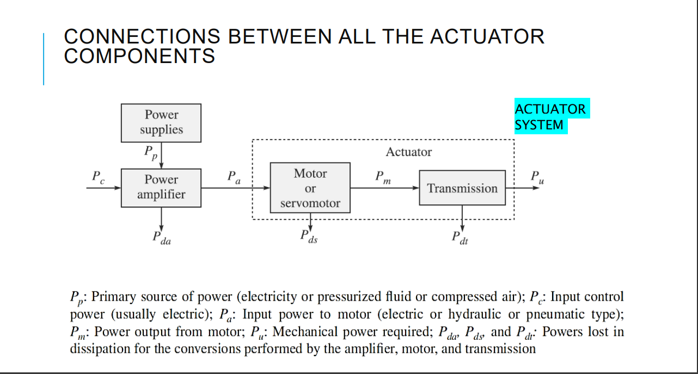

## 2. What are electric actuators. Mention its advantages and disadvantages

Electric actuators are generally those where an electric motor drives robot links through some mechanical transmission, e.g., gears, etc.

* Advantages: 
    * Widespread availability of power supply.
    * Basic drive element electric motor is usually lighter than pressurized fluid or compressed air.
    * High power-conversion efficiency.
    * No pollution of working environment.
    * Accuracy and repeatability of electric drive robots are normally better than fluid power 
    * Being relatively quiet and clean, they are very acceptable environmentally.
    * They are easily maintained and repaired.
    * Structural components can be lightweight.
    * The drive system is well suited to electronic control.

## 3. What is a stepper motor? Explain permanent magnet stepper motor with a neat diagram

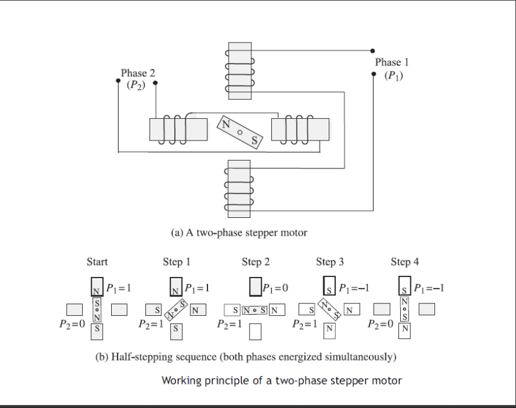   

* Normally, the shaft of a stepper motors rotates incrementally in equal steps in response to a programmed input pulse train.
* A current in any of the two phases, i.e., with P1 and P2, will magnetize the pair into north and south poles, indicted with N and S, respectively.
* Accordingly, the permanent magnet at the centre will rotate in order to align itself along a particular phase, which is demonstrated.
* Switching the currents in the two phases in an appropriate sequence can produce either clockwise (CW) or counterclockwise (CCW) rotations.
* The switching sequence corresponds to what is known as half-stepping with a step angle of 45°, whereas the full-stepping corresponds to 90° in which one phase is energized at a time.

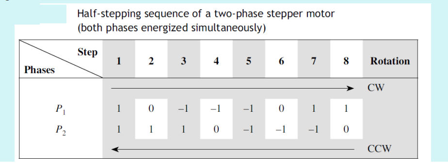

* Micro-stepping (non-identical steps) up to 1/125 of full-step by changing the currents in small steps instead of switching them on and off, as in the case of half- and full-stepping. 
* While micro-stepping is advantageous from the point of view of accurate motion control using a stepper motor, it has the disadvantage of reduced motor torque. 
* The steps are achieved through phase activation or switching sequences triggered by the pulse sequences.
* The switching logic that decides the states of the phases of a given step can be generated using a look-up table.
* The same sequences can also be generated using a logic circuitry which is typically an electronic device.

* As the rotor indexes round a specific amount for each control pulse, any error in positioning is noncumulative.
* To know the final position of the rotor, all that is required is to count the number of pulses fed into the stator’s phase winding of the motor.
* The number of pulses per unit time determines the motor speed.
* The rotor can be made to index slowly, coming to rest after each increment or it can move rapidly in a continuous motion termed slewing. 
* Maximum dynamic torque in a stepper motor occurs at low pulse rates.

* Therefore, it can easily accelerate a load. Once the required position is achieved and the command pulses cease, the shaft stops without the need for clutches or brakes.
* The actual rotational movements or step angles of the shaft are obtainable typically from 1.8° to 90° depending on the particular motor choices.
* Thus, with a nominal step angle of 1.8°, a stream of 1000 pulses will give an angular displacement of 1800° or five complete revolutions.
* They have also a low velocity capability without the need for gear reduction. For instance, if the previously mentioned motor is driven by 500 pulses per second, it will rotate at 150 rpm.
* Other advantages of the stepper motor are that the motor inertia is often low, and also if more than one stepper motor is driven from the same source then they will maintain perfect synchronizations.

### Advantages

1. Due to their internal structure, stepper motors do not require a sensor to detect the motor position.
2. Since the motor moves by performing “steps,” by simply counting these steps, you can obtain the motor position at a given time.
3. In addition, stepper motor control is pretty simple.
4. The motor does need a driver, but does not need complex calculations or tuning to work properly.
5. Stepper motors offer good torque at low speeds, are great for holding position, and also tend to have a long lifespan.

### Disadvantages

1. They can miss a step if the load torque is too high. 
2. These motors always drain maximum current even when still, which makes efficiency worse and can cause overheating.
3. Stepper motors have low torque and become pretty noisy at high speeds.
4. Finally, stepper motors have low power density and a low torque-to-inertia ratio.
5. Low efficiency 
6. Drive inputs and circuitry have to be carefully designed in relation to the torque and speed required.

  

   

## 4. Draw and explain the working principle of a two-phase stepper motor.

>Same as ans 3

## 5. Explain the working of a Brushless Permanent Magnet DC motor.

* The problem with dc motors is that they require a commutator and brushes in order to periodically reverse the current through each armature coil.
* The brushes make sliding contacts with the commutators and as a consequence sparks jump between the two and they suffer wear.
* Brushes have to be periodically changed and the commutator resurfaced.
* To avoid such problems, brushless motors have been designed.

 

* Essentially, they consist of a sequence of stator coiled and a permanent magnet rotor.
* A current-carrying conductor in a magnetic field experiences a force; likewise, as a consequence of Newton’s third law of motion, the magnet  will also experience an opposite and equal force.
* With the conventional dc motor, the magnet is fixed and the current-carrying conductors made to move.
* With the brushless permanent-magnet dc motor the reverse is the case, the current-carrying conductors are fixed and the magnetic field moves.
* The rotor is a ferrite or ceramic permanent magnet.
* In concept, brushless dc motors are somewhat similar to permanent-magnet stepper motors explained
* The current to the stator coils is electronically switched by transistors in sequence round the coils, the switching being controlled by the position of the rotor so that there are always forces acting on the magnet causing it to rotate in the same direction.

  

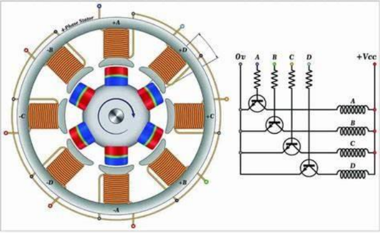   

### Advantages

The brushless motors have many advantages over conventional dc motors. For example,
1. They have better heat dissipation; heat being more easily lost from the stator than the rotor.
2. There is reduced rotor inertia. Hence, they weigh less and low mass for a specified torque rating.
3. The motors in themselves are less expensive.
4. They are more durable and have longer life.
5. Low maintenance.
6. Lower mechanical loading.
7. Improved safety.
8. Quieter operation.
9. They are of smaller dimensions of comparable power.

The absence of brushes reduces maintenance costs due to brush and commutator wear, and also allows electric
robots to be used in hazardous areas with flammable atmospheres such as are found in spray-painting applications.

## 6. Explain the typical layout of a DC servo motor and the controller of a DC servo motor.

  

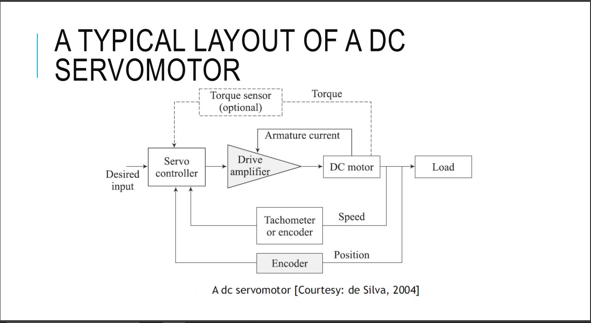   

1. Why Servo Motors?

    * Servomotors are motors with motion feedback control, which are able to follow a specified motion trajectory.
    * In a dc servomotor, both angular position and speed might be measured using, say, shaft encoders, tachometers, resolvers, potentiometers, etc., and compared with the desired position and speed.
    * The error signal which is the difference between the desired minus actual responses is conditioned and compensated using analog circuitry or is processed by a digital hardware processor or a computer, and supplied to drive the servomotor toward the desired response.
    * Motion control implies indirect torque control of the motor that causes the motion. In some applications like grinding, etc., where
    torque itself is a primary output, direct control of motor torque would be desirable.
    * This can be accomplished using feedback of the armature current or the fi eld current because those currents determine the motor torque is desirable.
    * This can be accomplished using feedback of the armature current or the field current because those currents determine the motor torque

2. Working

    * Note that the control of a dc motor is achieved by controlling either the stator field flux or the armature flux. 
    * If the armature and fi eld windings are connected through the same circuit, i.e., one of the winding types, both techniques are implemented simultaneously. 
    * Two methods of control are armature control and field control. 
    * In armature control, the fi eld current in the stator circuit is kept constant and the input voltage to the rotor is varied in order to achieve a desired performance.
    * In the field control, on the other hand, the armature voltage is kept constant and input voltage to the field circuit is varied.
    * These winding currents are generated using a motor driver.
    * It is a hardware unit that generates necessary current to energize the windings of the motor.
    * By controlling the current generated by the driver, the motor torque can be controlled.
    * By receiving feedback from a motion sensor (encoder tachometer, etc.), the angular position and the speed of the motor can be controlled.
    * The drive unit of a dc servomotor primarily consists of a driver amplifier (commercially available amplifiers are linear amplifier or pulse-width modulation, i.e., PWM, amplifier), with additional circuitry and a dc power supply.
    * The driver is commanded by a control input provided by a host computer through an interface (input/ output) card.
    * Also, the driver parameters like amplifier gains are software programmable and can be set by the host computer.
    * The control computer receives a feedback signal of the motor motion, through the interface board, and generates a control signal, using a suitable control law
    * The signal is then provided to the drive amplifier, again through the interface board.
    * An interface board or Data Acquisition (DAQ) card is a hardware module with Digital-to-Analog (DAC) and Analog-to-Digital (ADC) capabilities built-in. These are generally parts of a robot’s control system.
    * The final control of a dc motor is accomplished by controlling the supply voltage to either the armature circuit or the field circuit.
    * A dissipative method of achieving this involves using a variable resistor in series with the supply source to the circuit.
    * This method has disadvantages of high heat generation, etc. Instead, the voltage to a dc motor is controlled by using a solid-state switch known as a thyristor to vary the off time of fixed voltage level, while keeping the period of pulse signal constant.

  

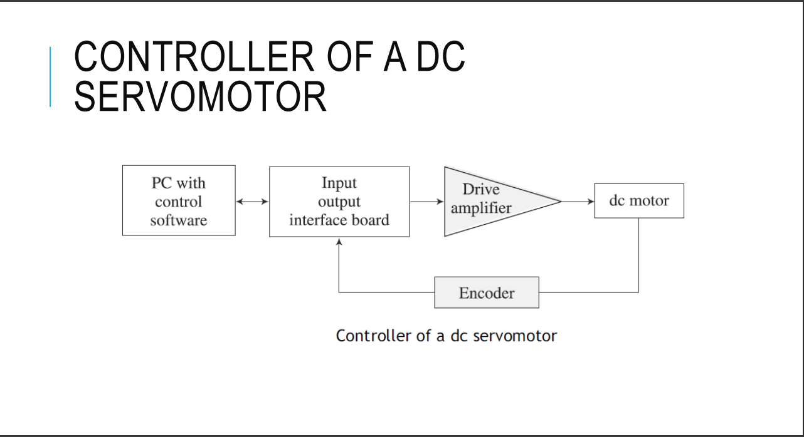

  

## 7. Explain briefly Three-phase Induction motor and Synchronous motor with a diagram

  
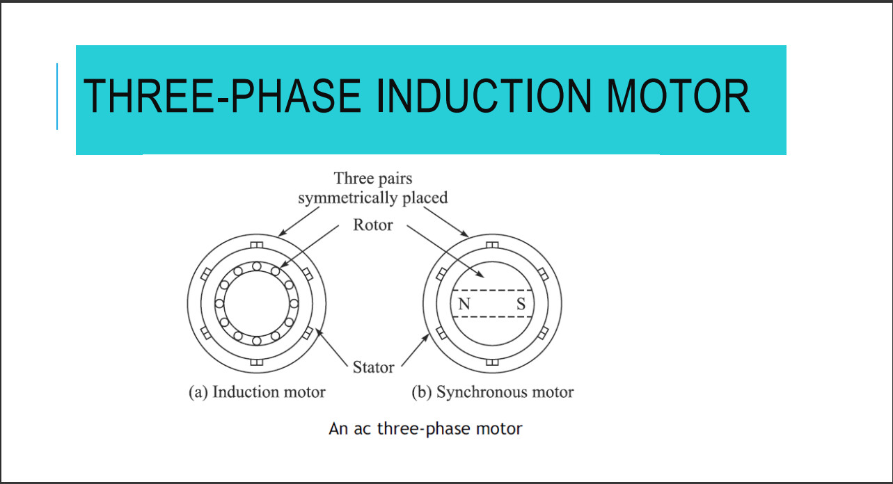
  

### 3 Phase Induction motor
* As shown in Fig. above, it is similar to the single-phase induction motor but has a stator with three windings located 120° apart, each winding being connected to one of the three lines of the supply.
* Because the three phases reach their maximum currents at different times, the magnetic field can be considered to rotate round the stator * poles, completing one rotation in one full cycle of the current.
* The rotation of the fi eld is much smoother than with the singlephase motor.
* The three-phase motor has a great advantage over the single-phase motor in being self-starting.
* The direction of rotation is reversed by interchanging any two of the line connections, thus changing the direction of rotation of the magnetic field.

  

### Synchronous motor

* A synchronous motor has a stator similar to those described above for induction motors, but a rotor is a permanent magnet as shown in Fig. above.
* The magnetic fi eld produced by the stator rotates and so the magnet rotates with it.
* With one pair of poles per phase of the supply, the magnetic fi eld rotates through 360° in one cycle of the supply and so the frequency of rotation with this arrangement is the same as the frequency of the supply.
* Synchronous motors are used when a precise speed is required. They are not self-starting and some system has to be employed to start them.

## 8. Explain the working of a single-phase squirrel cage induction motor.

  

  

* It consists of a squirrel-cage rotor, this being copper or aluminum bars that fit into slots in end rings to form complete electrical circuits, as shown in Fig. . There are no external electrical connections to the rotor.
* The basic motor consists of this rotor with a stator having a set of windings.
* When an alternating current passes through the stator windings, an alternative magnetic field is produced, which appears like a rotating magnetic field.
* The rotating field in the stator intercepts the rotating windings, thereby generating an induced current due to mutual induction or transformer action (hence, the name induction motor).
* The resulting secondary magnetic flux interacts with the primary, rotating magnetic flux, thereby producing a torque in the direction of rotation of the stator field.
* This torque drives the rotor.
* As the rotor speed increases, initially the motor torque also increases because of secondary interactions between the stator circuit and the rotor circuit even though the relative speed of the rotating field with respect to the rotor decreases, which reduces the rate of change of flux linkage and, hence, the direct transformer action.
* For a single-phase supply, when the rotor is stationary initially, the forces on the current-carrying conductors or the rotor in the magnetic field of the stator are such as to result in no net torque.
* Hence, the motor is not self-starting.
* A number of methods are used to make the motor selfstarting and give this initial impetus to start it.
* For example, to provide the starting torque, most single-phase motorsave a main and auxiliary winding.
* The auxiliary winding current from the main winding is phase-shifted.
* Connecting a capacitor in series with the auxiliary winding causes the motor to start rotating.
* The rotor rotates at a speed determined by the frequency of the alternating current applied to the stator.
* For a constant frequency supply to a two-pole single-phase motor, the magnetic fi eld will alternate at this frequency.
* This speed of rotation of the magnetic fi eld is termed synchronous speed.
* The rotor will never quite match this frequency of rotation, typically differing from it by about 1 to 3%.
* For a 50 Hz supply, the speed of rotation of the rotor, i.e., wm, will be almost 50 revolutions per second.

## 9. Compare the functional differences of DC and AC motors.

1. **Power Source:**
   - **AC Motor:** Powered by alternating current (AC), which periodically reverses direction.
   - **DC Motor:** Powered by direct current (DC), which flows in a single direction.

2. **Construction:**
   - **AC Motor:** Typically consists of a stator (stationary part) and a rotor (rotating part). The stator creates a rotating magnetic field that induces current in the rotor.
   - **DC Motor:** Consists of a stator, a rotor (also called an armature), and a commutator. The commutator and brushes supply current to the rotor windings.

3. **Types:**
   - **AC Motor:** Includes types such as synchronous and asynchronous (induction) motors.
   - **DC Motor:** Includes types such as brushed and brushless motors.

4. **Maintenance:**
   - **AC Motor:** Generally requires less maintenance due to the absence of brushes and commutators.
   - **DC Motor:** Requires more maintenance due to brushes and commutators which wear out over time.

5. **Speed Control:**
   - **AC Motor:** Speed control is complex and typically involves frequency converters or variable frequency drives (VFDs).
   - **DC Motor:** Speed control is simpler, achieved by varying the voltage or using pulse-width modulation (PWM).

6. **Starting Mechanism:**
   - **AC Motor:** Requires starting mechanisms like capacitors or soft starters to handle the high inrush current.
   - **DC Motor:** Generally has a simpler starting process, often using resistors or electronic controls.

7. **Efficiency:**
   - **AC Motor:** Generally more efficient, especially induction motors which have fewer losses.
   - **DC Motor:** Less efficient due to losses in brushes and commutators.

8. **Applications:**
   - **AC Motor:** Widely used in household appliances, industrial machinery, and HVAC systems.
   - **DC Motor:** Common in applications requiring variable speed and torque control, such as electric vehicles, robotics, and small household appliances.

9. **Torque Characteristics:**
   - **AC Motor:** Produces smooth and constant torque over a wide range of speeds.
   - **DC Motor:** Provides high starting torque and variable speed operation.

10. **Power Supply Infrastructure:**
    - **AC Motor:** Compatible with standard power grids, which typically supply AC.
    - **DC Motor:** Requires a DC power source or a converter to change AC to DC.

These differences highlight the unique characteristics and suitable applications for AC and DC motors.

## 10. Compare Hydraulic and Pneumatic actuators.

1. **Power Source:**
   - **Pneumatic Actuators:** Use compressed air as the power source.
   - **Hydraulic Actuators:** Use pressurized hydraulic fluid (usually oil) as the power source.

2. **Operating Pressure:**
   - **Pneumatic Actuators:** Typically operate at lower pressures, usually around 80-100 psi (pounds per square inch).
   - **Hydraulic Actuators:** Operate at much higher pressures, often ranging from 1,000 to 5,000 psi or more.

3. **Force Output:**
   - **Pneumatic Actuators:** Provide lower force output compared to hydraulic actuators.
   - **Hydraulic Actuators:** Can produce significantly higher force output due to the higher operating pressures.

4. **Speed of Operation:**
   - **Pneumatic Actuators:** Generally faster in operation, suitable for applications requiring quick movement.
   - **Hydraulic Actuators:** Typically slower, but offer precise control and constant force.

5. **Precision and Control:**
   - **Pneumatic Actuators:** Less precise in control due to the compressibility of air.
   - **Hydraulic Actuators:** More precise and controllable, providing smooth and consistent movements.

6. **Maintenance:**
   - **Pneumatic Actuators:** Generally require less maintenance; easier to handle leaks as air is not harmful.
   - **Hydraulic Actuators:** Require more maintenance; dealing with hydraulic fluid leaks can be messy and environmentally hazardous.

7. **Size and Weight:**
   - **Pneumatic Actuators:** Typically lighter and more compact.
   - **Hydraulic Actuators:** Usually heavier and bulkier due to the need to handle higher pressures.

8. **Operating Environment:**
   - **Pneumatic Actuators:** Better suited for clean environments as they do not leak fluids; also safer in explosive environments as air is non-flammable.
   - **Hydraulic Actuators:** Can be used in a variety of environments, but leaks can be problematic in sensitive or clean areas.

9. **Energy Efficiency:**
   - **Pneumatic Actuators:** Generally less energy-efficient due to the compressibility of air and energy losses during compression.
   - **Hydraulic Actuators:** More energy-efficient as hydraulic fluids are incompressible, leading to less energy loss.

10. **Cost:**
    - **Pneumatic Actuators:** Usually have lower initial and operating costs, especially in systems where the air supply is already available.
    - **Hydraulic Actuators:** Typically have higher initial and operating costs due to the need for hydraulic pumps, reservoirs, and fluid maintenance.

These differences highlight the unique characteristics and suitable applications for pneumatic and hydraulic actuators.

## 11. Explain the different criteria involved in selection of motor for robotic applications.

Selecting the right motor for robotic applications involves considering various criteria to ensure optimal performance, efficiency, and reliability. Here are some key criteria involved in the selection process:

1. **Type of Motor:**
   - **DC Motors:** Provide high torque at low speeds, easy speed control, and are commonly used in battery-operated robots.
   - **AC Motors:** Suitable for high-power applications, less common in mobile robots.
   - **Stepper Motors:** Offer precise position control, ideal for open-loop systems where precise positioning is critical.
   - **Servo Motors:** Provide high precision, speed control, and torque, ideal for applications requiring accurate motion control.

2. **Torque Requirements:**
   - The motor must provide sufficient torque to move the robot's load, overcoming friction and inertia. This includes considering starting, running, and peak torque requirements.

3. **Speed Requirements:**
   - The motor should meet the desired speed range for the application. This includes considering both the maximum speed and the required speed control range.

4. **Power Supply:**
   - Compatibility with the available power source (e.g., battery, AC supply) is crucial. Consider voltage, current, and power ratings of the motor.

5. **Load Characteristics:**
   - The type of load (e.g., linear, rotational) and its characteristics (e.g., inertia, friction) affect motor selection. Motors must be capable of handling varying loads and dynamics.

6. **Control System:**
   - The complexity and requirements of the control system influence motor choice. For example, precise position control may necessitate a servo motor with feedback mechanisms.

7. **Size and Weight:**
   - The motor's size and weight should be compatible with the robot's design constraints. Compact and lightweight motors are preferred for mobile and space-constrained applications.

8. **Efficiency:**
   - High-efficiency motors reduce energy consumption and heat generation, extending battery life and improving overall system performance.

9. **Durability and Reliability:**
   - Motors should be robust and reliable, especially in demanding or harsh environments. Consider factors like duty cycle, operating temperature, and environmental conditions.

10. **Cost:**
    - Budget constraints influence motor selection. It's essential to balance performance requirements with cost considerations to select an economically viable motor.

11. **Feedback and Sensors:**
    - Motors with built-in feedback mechanisms (e.g., encoders, resolvers) provide precise control and monitoring capabilities, essential for closed-loop systems.

12. **Noise and Vibration:**
    - Minimizing noise and vibration is crucial in applications where smooth and quiet operation is required, such as in medical or domestic robots.

13. **Regulatory and Safety Requirements:**
    - Ensure the motor complies with relevant safety standards and regulations, especially in applications involving human interaction or hazardous environments.

14. **Integration with Other Components:**
    - Compatibility with other robotic components (e.g., controllers, gears, sensors) is essential for seamless integration and operation.

By carefully considering these criteria, you can select a motor that meets the specific requirements of your robotic application, ensuring optimal performance and reliability.

## 12. Explain the working of Mechanical Gripper.

A mechanical gripper is a device used in robotics and automation systems to grasp, hold, and manipulate objects. It mimics the function of a human hand but is designed to interface with robotic systems. Here’s an explanation of the working of a mechanical gripper:

### Components of a Mechanical Gripper

1. **Jaws/Fingers:** The parts of the gripper that come into direct contact with the object. These can be of various shapes and materials depending on the object to be handled.
2. **Actuator:** The mechanism that drives the movement of the jaws. This can be pneumatic, hydraulic, electric (motors), or mechanical (cams, levers).
3. **Frame/Body:** The main structure that holds the jaws and actuator together.
4. **Linkage Mechanism:** Transmits the actuator’s motion to the jaws, converting the actuator’s linear or rotary motion into the gripping motion.

### Working Principles

The working of a mechanical gripper involves several key steps:

1. **Activation:**
   - The actuator receives a command signal from the control system of the robot. Depending on the type of actuator, this could be an electrical signal for an electric motor, air pressure for a pneumatic system, or hydraulic fluid pressure for a hydraulic system.

2. **Motion Generation:**
   - The actuator converts the input energy into mechanical motion. For electric actuators, this involves the rotation of a motor; for pneumatic or hydraulic actuators, this involves the linear movement of a piston.

3. **Motion Transmission:**
   - The generated motion is transmitted to the gripper jaws through a linkage mechanism. This could involve gears, cams, levers, or direct coupling to the jaws.

4. **Gripping Action:**
   - As the motion is transmitted, the jaws of the gripper move towards each other (or away, depending on the design). The jaws are designed to close around the object securely. The shape and material of the jaws are chosen based on the object's geometry and material to ensure a secure grip without damaging the object.

5. **Holding and Manipulation:**
   - Once the jaws have gripped the object, the gripper holds it securely. The robot can then manipulate the object by moving the gripper to the desired location. The design ensures that the object remains stable during movement.

6. **Release:**
   - To release the object, the actuator is commanded to reverse its motion. This causes the jaws to open, releasing the object. The release mechanism must be controlled to ensure a smooth and precise release.

### Types of Mechanical Grippers

1. **Parallel Grippers:**
   - Jaws move in parallel to each other, suitable for objects with consistent shapes and sizes.

2. **Angular Grippers:**
   - Jaws pivot around a point, suitable for objects that require a wide opening range.

3. **Three-Finger Grippers:**
   - Provides better stability and is suitable for cylindrical or spherical objects.

4. **Custom Grippers:**
   - Designed for specific applications, customized to handle unique objects.

### Applications

- **Industrial Automation:** Assembly lines, pick-and-place operations.
- **Material Handling:** Moving parts in warehouses or production facilities.
- **Medical Robotics:** Handling delicate instruments or samples.
- **Consumer Products:** Robots in homes or retail settings handling various objects.

### Example

Consider a pneumatic parallel gripper used in an assembly line to pick and place electronic components. Here’s how it works:

1. **Command:** The control system sends a signal to the pneumatic actuator.
2. **Actuation:** Compressed air drives the piston inside the actuator.
3. **Motion Transmission:** The piston’s linear motion is transmitted to the jaws via a linkage mechanism.
4. **Gripping:** The jaws close in parallel, grasping the electronic component.
5. **Handling:** The robot moves the gripper to the placement location.
6. **Release:** The actuator reverses, causing the jaws to open and release the component.

Mechanical grippers are essential in robotics for their ability to handle a wide variety of objects with precision and reliability.

## 13. With a diagram explain Variable-reluctance stepper motor

In a Variable Reluctance Stepper motor:

  
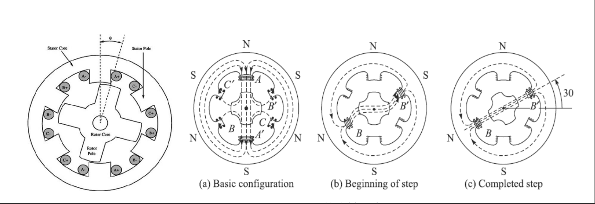
  

* Rotor rotates due to reluctance that is offers to magnetics flux lines. When motor moves Reduction in reluctance in air,more energy in magnetic field.

### WORKING 
* Magnetic reluctance, or reluctance, is the analog of electrical resistance. Just as current occurs only in aclosed loop, so magnetic flux occurs only around a closed path, although this path may be more varied than that of the current.
* The rotor is made of soft steel and it has four poles, whereas the stator has six poles. 
* When one of the phases, say AA’, is excited due to a dc current passing through the coils around the poles, the rotor positions itself to complete the flux path.
* Note that there is a main flux path through the aligned rotor and stator teeth, with secondary flux paths occurring as indicated.
* When rotor and stator teeth are aligned in this manner, the reluctance is minimized and the rotor is at rest in this position. This flux path can be considered rather like an elastic thread and always trying to shorten itself.
* The rotor will move until the rotor and stator poles are lined up. This is termed as the position of minimum reluctance.
* To rotate the motor counterclockwise, the phase AA’ is turned off and phase BB’ is excited.
* This form of a stepper motor generally gives step angles of 7.5° or 15°, which are referred as half-stepping and full-stepping, respectively.
* Note that a disadvantage of variable-reluctance stepper motors is that it has zero holding torque when the stator windings are not energized (power off) because the rotor is not magnetized.
* Hence, it has no capacity to hold a load in power-off mode unless mechanical brakes are employed.

## 14. With a diagram explain hybrid stepper motor

  
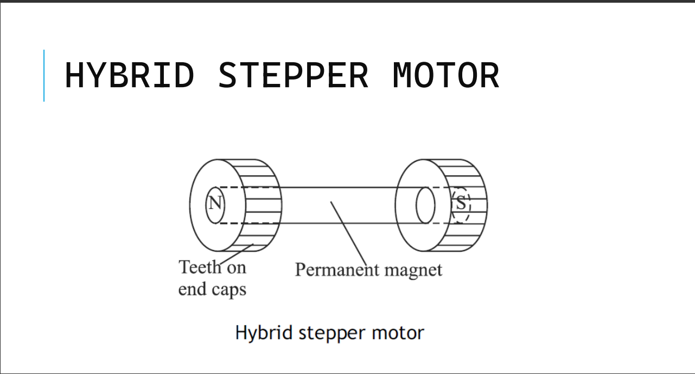
  

* Hybrid stepper motors are the most common variety of stepper motors in engineering applications.
* They combine the features of both the variable reluctance and permanent-magnet motors, having a permanent magnet encaged in iron caps which are cut to have teeth.
* A hybrid stepper motor has two stacks of rotor teeth on its shaft (WRStepper, 2013).
* The two rotor stacks are magnetized to have opposite polarities, while two stator segments surround the two rotor stacks.
* The rotor sets itself in the minimum reluctance position in response to a pair of stator coils being energized. Typical step angles are 0.9° and 1.8°.

## 15. Explain the working principle of a DC motor. Briefly explain types of DC motors

  
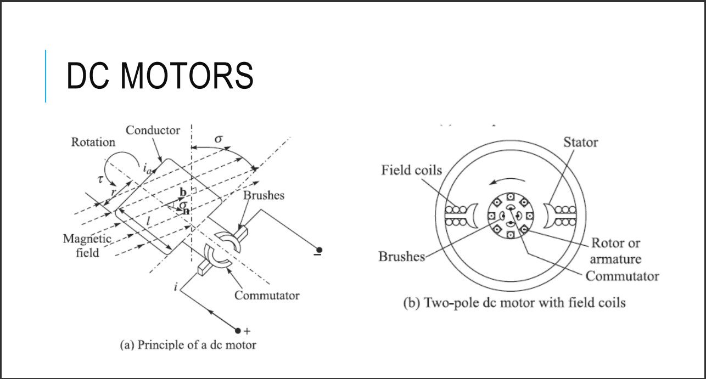
  

* The operation of any electric motor is based upon the principle which states that a conductor will experience a force if an electric current in that conductor flows at right angles to a magnetic field.
* Therefore, to construct a motor, two basic components are required.
* One to produce the magnetic field usually termed the stator, and another to act as the conductor usually termed the armature or the rotor.
* The principle is for one element of a dc motor, whereas a two-pole dc motor is shown.
* The magnetic field may be created either by field coils wound on the stator or by permanent magnets.
* The field coils, if used, would be provided with an electric current to create magnetic poles on the stator.
* The current is supplied to a conductor via the brushes and commutators.
* The current passing through the field produces a torque, or more accurately static torque on the conductors.

### Shunt Wound DC Motor

  
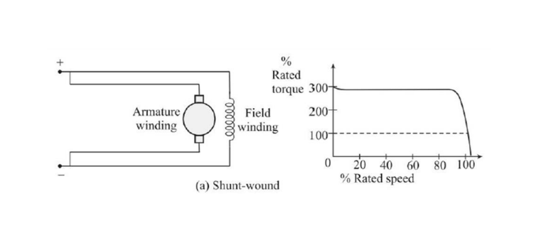
  

* In a shunt-wound motor, the armature windings and field windings are connected in parallel. 
* At steady state, the back electromotive force (e.m.f.) depends directly on the supply voltage. 
* Since the back e.m.f. is proportional to the speed, it follows that the speed controllability is good with the shunt-wound configuration.

### Series Wound DC Motor

  
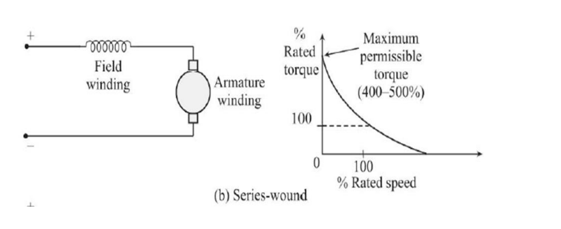
  

* In series-wound motors they are connected in series. 
* The relation between the back e.m.f. and supply voltage is coupled through both the armature windings and the field windings. 
* Hence, its speed controllability is relatively poor. 
* But in this case, a relatively large current flows through both windings at low speeds of the motor, giving higher starting torque. 
* Also, the operation is approximately at constant power.

### Compund Wound DC Motor

  
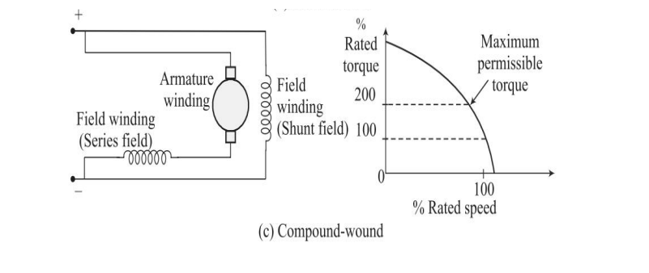
  

* In the compound wound motor, a part of the field windings relates to the armature windings in series and the other part is connected in parallel, this kind of motors provides a compromise performance between the extremes of speed controllability and higher starting torque characteristics, as provided by the shunt wound and series-wound motors, respectively.

## 16. With a diagram explain two-pole dc motor with field coils

  

  

A two-pole DC motor with field coils is a type of direct current motor that uses a pair of magnetic poles (north and south) created by electromagnets (field coils) to generate the magnetic field necessary for motor operation. Here’s a detailed explanation of its components and working principles:

### Components

1. **Stator:**
   - The stationary part of the motor.
   - Contains the field coils which create the magnetic field when energized.

2. **Field Coils (Electromagnets):**
   - Coils of wire wound around a magnetic core.
   - When electric current passes through the field coils, they generate a magnetic field.
   - Creates two magnetic poles: one north and one south.

3. **Rotor (Armature):**
   - The rotating part of the motor.
   - Contains windings (coils) connected to a commutator.
   - Placed inside the stator and rotates within the magnetic field created by the field coils.

4. **Commutator:**
   - A cylindrical assembly of segments connected to the armature windings.
   - Ensures that the current direction in the armature windings changes periodically to maintain continuous rotation.

5. **Brushes:**
   - Made of carbon or graphite.
   - Press against the commutator and conduct electric current between the external power source and the rotating armature.

6. **Power Supply:**
   - Provides the direct current (DC) needed to energize the field coils and armature.

### Working Principles

1. **Magnetic Field Creation:**
   - When DC voltage is applied to the field coils, current flows through them, creating a magnetic field.
   - The field coils are arranged such that one becomes a north pole and the other a south pole, generating a two-pole magnetic field in the stator.

2. **Armature Current:**
   - DC voltage is also applied to the armature windings via the brushes and commutator.
   - Current flowing through the armature windings generates its own magnetic field.

3. **Interaction of Magnetic Fields:**
   - The magnetic field created by the armature interacts with the magnetic field of the stator.
   - According to the Lorentz force law, the interaction of these magnetic fields produces a torque on the armature, causing it to rotate.

4. **Commutation:**
   - As the armature rotates, the commutator periodically reverses the direction of current through the armature windings.
   - This reversal ensures that the armature windings continue to experience a torque in the same rotational direction, maintaining continuous rotation.

5. **Rotation and Torque:**
   - The continuous interaction between the magnetic fields of the stator and the armature produces a consistent torque, driving the rotation of the armature.
   - The speed and torque of the motor can be controlled by varying the voltage applied to the armature and field coils.

### Applications

Two-pole DC motors with field coils are used in various applications where precise speed and torque control are required, such as:
- Industrial machinery
- Electric vehicles
- Robotics
- Conveyor systems

### Advantages

1. **Simple Construction:**
   - Relatively straightforward design makes it easy to manufacture and maintain.

2. **Good Speed Control:**
   - Excellent speed control over a wide range by adjusting the voltage and current supplied.

3. **High Starting Torque:**
   - Capable of producing high starting torque, making them suitable for applications requiring strong initial force.

### Limitations

1. **Brush Wear:**
   - Brushes wear out over time and require periodic replacement, leading to maintenance needs.

2. **Commutator Sparking:**
   - Sparking can occur at the brushes and commutator, especially under high load conditions, which can cause wear and electromagnetic interference.

In summary, a two-pole DC motor with field coils operates by creating a magnetic field with electromagnets and using the interaction of this field with the armature's magnetic field to generate rotational motion. This type of motor is favored for its simplicity and effective control of speed and torque, despite requiring regular maintenance for the brushes and commutator.

## 17. Explain two types of permanent magnet DC motor configurations

  
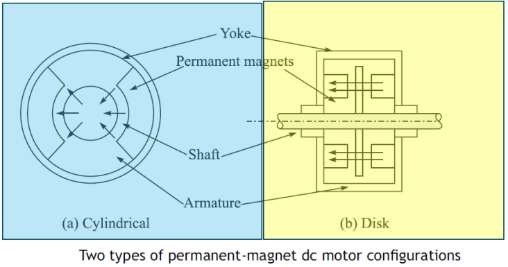
  

  

  

## 18. Mention the typical advantages and disadvantages of ac motor over dc motors

>Same as ans 9

## 19. Mention the typical advantages and disadvantages of Hydraulic Actuators and Pneumatic Actuators

>Same as ans 10

## 20. Explain different types of Grippers

Grippers are essential components in robotic systems, allowing robots to interact with objects in their environment. There are several types of grippers, each designed for specific applications and types of objects. Here’s an overview of the different types of grippers:

### 1. **Mechanical Grippers**
Mechanical grippers use mechanical means to grip objects. They are the most common type and can be further divided into several subtypes:

#### a. **Parallel Grippers**
- **Description:** The jaws move parallel to each other to grip an object.
- **Applications:** Ideal for picking up objects with uniform shapes and sizes.
- **Advantages:** Precise and stable grip, easy to control.

#### b. **Angular Grippers**
- **Description:** The jaws open and close around a pivot point, creating an angular motion.
- **Applications:** Suitable for gripping objects that are larger or have irregular shapes.
- **Advantages:** Can handle a wider range of object sizes compared to parallel grippers.

#### c. **Three-Finger Grippers**
- **Description:** Typically three jaws or fingers that move radially to grip cylindrical or spherical objects.
- **Applications:** Commonly used for handling round objects like pipes or bottles.
- **Advantages:** Provides a stable grip on round objects.

### 2. **Vacuum Grippers**
Vacuum grippers use suction to hold objects. They are commonly used in applications where mechanical gripping is difficult.

- **Description:** Create a vacuum between the gripper and the object's surface using suction cups.
- **Applications:** Ideal for picking up flat, smooth, or porous surfaces like glass, metal sheets, and cardboard boxes.
- **Advantages:** Can handle delicate objects without causing damage, simple design.

### 3. **Magnetic Grippers**
Magnetic grippers use magnetic force to attract and hold ferromagnetic materials.

- **Description:** Use permanent magnets or electromagnets to grip objects.
- **Applications:** Used for handling metal objects such as sheets, rods, or scrap materials.
- **Advantages:** No need for direct contact, can handle hot or dirty objects, quick engagement and release.

### 4. **Adhesive Grippers**
Adhesive grippers use sticky substances to grip objects.

- **Description:** Utilize adhesives like gecko-inspired materials or traditional sticky substances to grip objects.
- **Applications:** Suitable for handling objects with smooth surfaces, in clean environments.
- **Advantages:** Can handle a variety of materials, including delicate and irregularly shaped objects.

### 5. **Soft Grippers**
Soft grippers use flexible materials and often mimic the adaptability of human fingers.

- **Description:** Made from soft, flexible materials that conform to the shape of the object being gripped.
- **Applications:** Ideal for handling delicate, irregularly shaped, or fragile objects, such as food items or medical supplies.
- **Advantages:** Gentle grip, can adapt to a wide range of shapes and sizes.

### 6. **Pneumatic Grippers**
Pneumatic grippers use compressed air to drive their gripping action.

- **Description:** Use air pressure to open and close the jaws.
- **Applications:** Widely used in industrial automation for fast and repetitive tasks.
- **Advantages:** Fast response time, high gripping force, simple and robust design.

### 7. **Hydraulic Grippers**
Hydraulic grippers use pressurized hydraulic fluid to actuate the jaws.

- **Description:** Use hydraulic fluid to provide powerful gripping force.
- **Applications:** Suitable for heavy-duty applications where high force is required.
- **Advantages:** High gripping force, suitable for heavy and large objects.

### 8. **Electrostatic Grippers**
Electrostatic grippers use electrostatic forces to hold objects.

- **Description:** Create an electrostatic charge that attracts and holds objects.
- **Applications:** Commonly used for handling thin, flat, or delicate materials like semiconductor wafers or paper.
- **Advantages:** Non-contact gripping, can handle very thin and light objects.

### 9. **Capacitive Grippers**
Capacitive grippers use changes in capacitance to grip objects.

- **Description:** Detect and grip objects based on changes in capacitance when in proximity to the object.
- **Applications:** Often used in delicate applications, such as handling electronics or sensitive materials.
- **Advantages:** Can handle fragile and sensitive objects, precise control.

### 10. **Shape-Memory Alloy (SMA) Grippers**
Shape-memory alloy grippers use materials that change shape in response to temperature changes.

- **Description:** Use SMAs that contract or expand with temperature changes to open and close the jaws.
- **Applications:** Used in specialized applications where traditional actuators are not suitable.
- **Advantages:** Simple design, no need for complex actuation mechanisms, can be miniaturized.

Each type of gripper has its unique advantages and is suited for specific applications. The selection of a gripper type depends on the nature of the task, the properties of the objects to be handled, and the operational environment.