# 1. What are sensors? Explain the functions provided by sensors.

• Sensors in robots are like our nose, ears, mouth, and skin, whereas vision or robot vision can be thought of as our eyes. Robots, like humans, must gather extensive information about their environment in order to function effectively.
• They must pick up an object and know it has been picked up. As the robot arm moves through the 3-dimensional Cartesian space, it must avoid obstacles and approach items to be handled at a controlled speed.
• Some objects are heavy, others are fragile, and others are too hot to handle. These characteristics of objects and the environment must be recognized, and fed to the computer that controls a robot’s movement.
### Functions of Sensors 
• 1. Safe Operation: Sensors must protect human workers who work in the vicinity of the robot or other equipment. For example, one can provide a sensor on the floor of a work cell where a robot is working so that if anybody steps in the robot’s power should be switched off.
• 2. Interlocking: This is required to coordinate the sequence of operations on a component. For example, unless a turning is done on a component, it should not be transferred to the conveyor.
• 3. Inspection: This is essential for quality control. For example, one can use a vision system to measure the length of a component to check if it is within the acceptable tolerance or not.
• 4. Part Configuration: If a robot is used to weld two parts of a car body, the sensors must identify the correct configurations, i.e., position and orientation of the parts, before the robot
starts welding.

# 2. Explain briefly the classification of sensors with a diagram.

### SENSOR CLASSIFICATION
The major capabilities required by a robot are as follows:
• Simple Touch The presence or absence of an object.
• Taction or Complex Touch The presence of an object plus some information on its size and shape.
• Simple Force Measured force along a single axis.
• Complex Force Measured force along two or more axes.
• Proximity Noncontact detection of an object.
• Simple Vision Detection of edges, holes, corners, and so on.
• Complex Vision Recognition of shapes.

• Based on the type of signals a sensor or transducer receives and processes, it can be classified as analog or digital.
• In analog sensors, with the variation of input there is a continuous variation of output, whereas in case of digital sensors, the output is of digital or discrete nature.
• Example of analog sensors - potentiometers, tacho-generators located at the joints and strain-gauge-based sensors located at the end-effector of a robot
• Example of digital sensors - encoders, located at the robot’s joints
• Robot point of view sensors are, however, classified based on what they sense, i.e., the internal or external state of the robots, etc

  
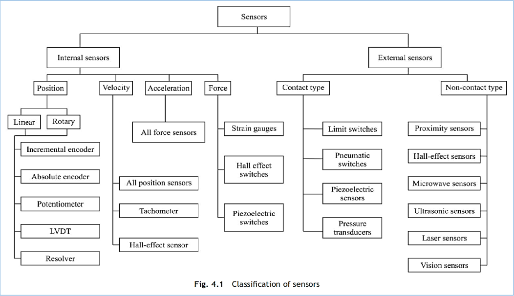
  

# 3. Explain briefly different types of internal sensors used in robots.

• Internal sensors, as the name suggests, are used to measure the internal state of a robot, i.e., its position, velocity, acceleration, etc., at a particular instant.
• Based on this information, the control command is decided by the controller.
• Depending on the quantities it measures, a sensor is termed as the
    • Position Sensor
    • Velocity Sensor
    • Acceleration Sensor
    • Force Sensor.

### Position Sensors
Position sensors measure the position of each joint, i.e., joint angle of a robot. From these joint angles, one can find the end-effector configuration, namely, its position and orientation.
Types of Position Sensor:
1. Encoder
2. Potentiometer
3. Linear Variable Differential Transformer
4. Synchros and Resolver

**Encoder**: The encoder is a digital optical device that converts motion into a sequence of digital pulses. By counting a single bit or by decoding a set of bits, the pulses can be converted to relative or absolute measurements. Thus, encoders are of incremental or absolute type.

### Velocity Sensors
• Velocity or speed sensors measure by taking consecutive position measurements at known time intervals and computing the time rate of change of the position values or directly finding it based on different principles.
• Types of velocity sensors are as follows
1. All Position Sensors
2. Tachometer
3. Hall-Effect Sensor

>All Position Sensors
• Basically, all position sensors when used with certain time bounds can give velocity,
• e.g., the number of pulses given by an incremental position encoder divided by the
time consumed in doing so. But this scheme puts some computational load on the
controller which may be busy in some other computations.

### Acceleration Sensors: 
• Similar to measurements of velocity from the information of position sensors, one can find the accelerations as the time rate of change of velocities obtained from velocity sensors or calculated from the position information.
• But this is not an efficient way to calculate the acceleration because this will put a heavy computational load on the computer and that can hamper the speed of operation of the system.
• Another way to compute the acceleration is to measure the force which is the result of mass times acceleration.

>Calculation of acceleration from Force
Acceleration Sensors: 
• Similar to measurements of velocity from the information of position sensors, one can find the accelerations as the time rate of change of velocities obtained from velocity sensors or calculated from the position information.
• But this is not an efficient way to calculate the acceleration because this will put a heavy computational load on the computer and that can hamper the speed of operation of the system.
• Another way to compute the acceleration is to measure the force which is the result of mass times acceleration.
• It is generally not desirable, as the noise in the measured data, if any, will be amplified.
• Alternatively, the use of integrators to obtain the velocity from the acceleration, and consequently the position, are recommended. Integrators tend to suppress the noise.

### Force Sensors: 
• A spring balance is an example of a force sensor in which a force, namely, the weight, is applied to the scale pan that causes displacement, i.e., the spring stretches.
• The displacement is then a measure of the force.
• There exist other types of force sensors, e.g., strain-gauge based, Hall-effect sensor, etc.

# 4. Explain the following sensors used in robots.
## Position sensors
>refer ans 3

## Potentiometers
• A potentiometer, also referred as simply pot, is a variable resistance device that expresses linear or angular displacements in terms of voltage, as shown in Figs. 4.3(a-b), respectively.
• It consists of a wiper that makes contact with a resistive element, and as this point of contact moves, the resistance between the wiper and end leads of the device changes in proportion to the displacement, x and q for linear and angular potentiometers, respectively.

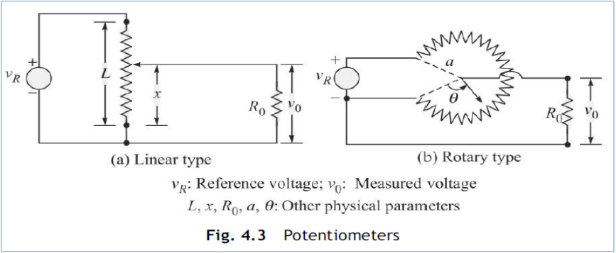

## LVDT 
• The Linear Variable Differential Transformer (LVDT) is one of the most used displacement transducers, particularly when high accuracy is needed.
• It generates an ac signal whose magnitude is related to the displacement of a moving core.
• The basic concept is that of a ferrous core moving in a magnetic field, the field being produced in a manner similar to that of a standard transformer.
• There is a central core surrounded by two identical secondary coils and a primary coil,
• As the core changes position with respect to the coils, it changes the magnetic field, and hence the voltage amplitude in the secondary coil changes as a linear function of the core displacement over a considerable segment.

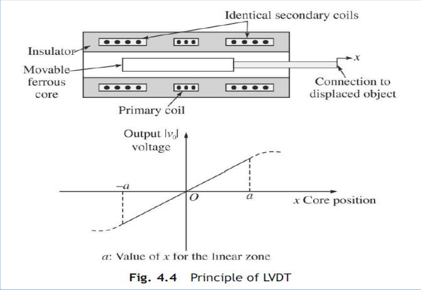

## Synchros and Resolver

• While encoders give digital output, Synchros and resolvers provide analog signal as their output.
• They consist of a rotating shaft (rotor) and a stationary housing (stator).
• Their signals must be converted into the digital form through an analog-to-digital converter before the signal is fed to the computer.
• In a simple synchro, the stator has three windings oriented 120° apart and electrically connected in a Y-connection.
• Resolvers differ from Synchros in that their stators have only two windings oriented at 90°.
• Because Synchros have three stator coils in a 120° orientation, they are more difficult than resolvers to manufacture and are, therefore, more costly.
• Modern resolvers, in contrast, are available in a brushless form that employ a transformer to couple the rotor signals from the stator to the rotor.
• The primary winding of this transformer resides on the stator, and the secondary on the rotor.
• Other resolvers use more traditional brushes or slip rings to couple the signal into the rotor winding.
• Brushless resolvers are more rugged than Synchros because there are no brushes to break or dislodge, and the life of a brushless resolver is limited only by its bearings.
• Most resolvers are specified to work over 2V to 40V rms (root mean square) and at frequencies from 400Hz to 10kHz. Angular accuracies range from 5 arc-minutes to 0.5 arc minutes.

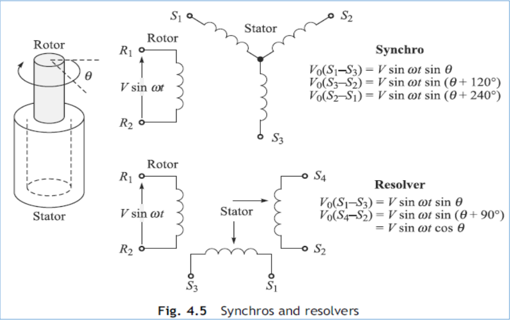

### Working!
• In operation, Synchros and resolvers resemble rotating transformers.
• The rotor winding is excited by an ac reference voltage, at frequencies up to a few kHz.
• The magnitude of the voltage induced in any stator winding is proportional to the sine of the angle θ between the rotor-coil axis and the stator-coil axis.
• In the case of a synchro, the voltage induced across any pair of stator terminals will be the vector sum of the voltages across the two connected coils.
• For example, if the rotor of a synchro is excited with a reference voltage, Vsin(ωt), across its terminal R1 and R2, the stator’s terminal will see voltages denoted as V0 in the form:

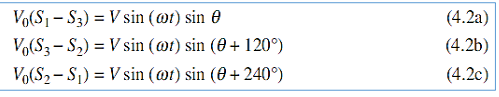

where S1, S2, etc., denotes the stator terminals.
• Moreover, V and ω are the input amplitude and frequency, respectively, whereas q is the shaft angle. In the case of a resolver, with a rotor ac reference voltage of V sin(ω t), the stator’s terminal voltages will be

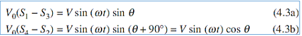

• As said earlier, the output of these Synchros and resolvers must be first digitized. To do this, analog-to-digital converters are used.
• These are typically 8-bit or 16-bit. An 8-bit means that the whole range of analog signals will be converted into a maximum of 28 = 256 values.

## Velocity sensors
>refer ans 3

## Acceleration sensors
>refer ans 3

## Force sensors
>refer ans 3

# 5. Explain briefly the different types of external sensors used in robots

• External sensors are primarily used to learn more about a robot’s environment, especially the objects being manipulated.
• External sensors can be divided into the following categories:
    • Contact type, and
    • Noncontact type.

### Contact Type - Limit Switch 
• A limit switch is constructed much as the ordinary light switch used at homes and offices.
• It has the same on-off characteristics.
• The limit switch usually has a pressure-sensitive mechanical arm, as shown in Fig. 4.11(a).
• When an object applies pressure on the mechanical arm, the switch is energized.

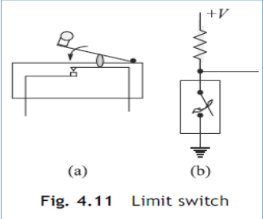

### Noncontact Type
1. Proximity Sensor
2. Semiconductor Displacement Sensor

#### Proximity Sensor:
• Proximity sensing is the technique of detecting the presence or absence of an object with an electronic noncontact-type sensor.
• Proximity sensors are of two types, Inductive and Capacitive.
• Inductive proximity sensors are used in place of limit switches for noncontact sensing of metallic objects, whereas capacitive proximity sensors are used on the same basis as inductive proximity sensors. However, these can also detect nonmetallic objects.

#### Inductive Proximity Sensor 
• All inductive proximity sensors consist of four basic elements, namely, the following:
• Sensor coil and ferrite core
• Oscillator circuit
• Detector circuit
• Solid-state output circuit
• As shown in Fig. 4.12, the oscillator circuit generates a radio-frequency electromagnetic field.

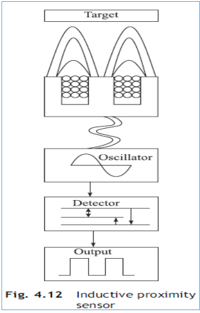

#### Capacitive Proximity Sensor 
• A capacitive proximity sensor operates much like an inductive proximity sensor. However, the means of sensing is considerably different.
• Capacitive sensing is based on dielectric capacitance. Capacitance is the property of insulators to store the charge.

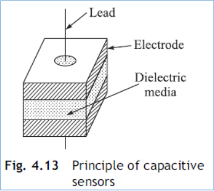

#### Semiconductor Displacement Sensor 
• As shown in Fig. 4.14, a semiconductor displacement sensor uses a semiconductor Light Emitting Diode (LED) or laser as a light source, and a Position-Sensitive Detector (PSD).
• The laser beam is focused on the target by a lens. The target reflects the beam, which is then focused on to the PSD forming a beam spot.
• The beam spot moves on the PSD as the target moves. The displacement of the workpiece can then be determined by detecting the movement of the beam spot.

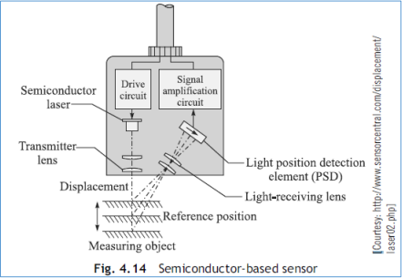

#### VISION
• Vision can be defined as the task of extracting information about the external world from light rays imaged by a camera or an eye.
• Vision, also referred in the literature as computer vision or machine vision or robot vision, is a major subject of research and many textbooks.
• The vision systems or vision sensors are classified as external noncontact type. They are used by robots to let them look around and find the parts, for example, picking and placing them at appropriate locations.
• Earlier, fixtures were used with robots for accurate positioning of the parts. Such fixtures are very expensive.

# 6. What is a vision sensor? Explain the task performed by vision system in robots.

## VISION
• Vision can be defined as the task of extracting information about the external world from light rays imaged by a camera or an eye.
• Vision, also referred in the literature as computer vision or machine vision or robot vision, is a major subject of research and many textbooks.
• The vision systems or vision sensors are classified as external noncontact type.
They are used by robots to let them look around and find the parts, for example, picking and placing them at appropriate locations.
• Earlier, fixtures were used with robots for accurate positioning of the parts. Such fixtures are very expensive.

>A vision system can provide alternative economic solution. Other tasks of vision systems used with robots include the following:
1. Inspection Checking for gross surface defects, discovery of flaws in labeling, verification of the presence of components in assembly, measuring for dimensional accuracy, checking the presence of holes and other features in a part.
2. Identification Here, the purpose is to recognize and classify an object rather than to inspect it. Inspection implies that the part must be either accepted or rejected.
3. Visual Servoing and Navigation Control The purpose here is to direct the actions of the robot based on its visual inputs, for example, to control the trajectory of the robot’s end-effector toward an object in the workspace. Industrial applications of visual servoing are part positioning, retrieving parts moving along a conveyor, seam tracking in continuous arc welding, etc.

• All of the above applications someway require
    • determination of the configuration of the objects,
    • motion of the objects,
    • reconstruction of the 3D geometry of the objects from their 2D images for measurements, and
    • building the maps of the environments for a robot’s navigation.
• Coverage of vision system is from a few millimetres to tens of
meters with either narrow or wide angles, depending upon the
system needs and design.
• Figure 4.15 shows a typical visual system connected to an
industrial robot.

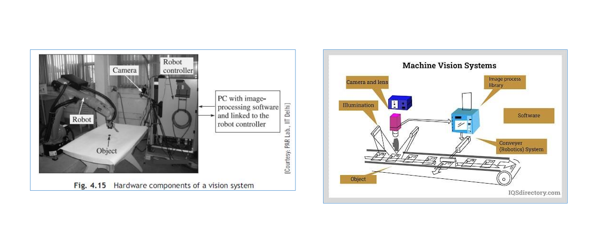

# 7. Explain the elements in a vision system used in robots.

Elements in a Vision Sensor
• In vision systems, the principal imaging component is a
complete camera including sensing array, associated
electronics, output signal format, and lens, as shown in Fig.
4.16.
• Camera
• Lighting Techniques

>task of camera
• The task of the camera as a vision sensor is to measure the intensity of the light reflected by an object, as indicated in Fig. 4.16, using a photosensitive element termed pixel (or photosite).
• A pixel is capable of transforming light energy into electric energy.
• The sensors of different types like CCD, CMOS, etc., are available depending on the physical principle exploited to realize the energy transformation.
• Depending on the application, the camera could be RS-170/CCIR, NTSC/PAL (These are American RS-170 monocolour, European/Indian CCIR monocolour, NTSC colour, PAL color television standard signal produced by the video cameras, respectively) progressive scan, variable scan, or line scan.

# 8. Explain the steps involved in vision system
# 9. Explain the hierarchy of a vision system
# 10. What are the typical difficulties in a vision system.
# 11. Explain some of the commonly used devices for signal conditioning
# 12. Explain the following devices used for signal conditioning
## Amplifiers
## Filters
## Modulators and demodulators
## Analog and digital conversions
## Bridge rectifiers
## Signal analyse