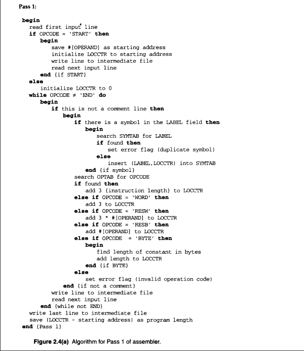
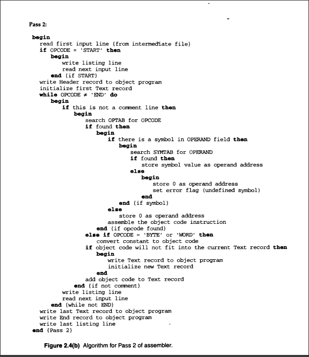
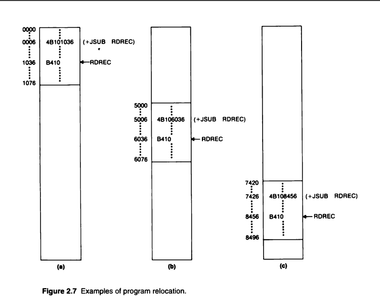
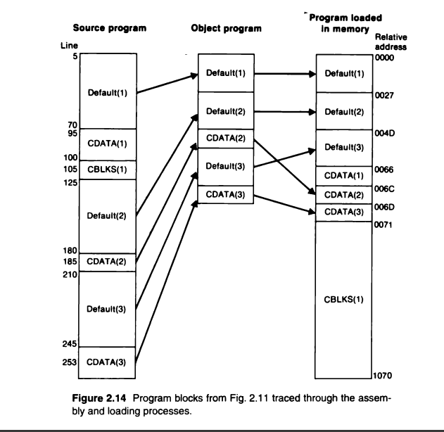

# MODULE 1 : SYSTEM SOFTWARE

>Refer C.W. for problems solved in class.

## System Software and Machine Architecture

* System Softwares are programs that are intended to support the operation and the use of a computer itself.

## Simplified Instructional Computer (SIC)

>Simplified Instructional computer (SIC) is a hypothetical computer that has been designed to include hardware features of the most often found on real machines.

### Machine Architecture

#### Memory

* Memory consists of 8 bit bytes, 3 consecutive bytes form a word.
* All addresses are byte addresses.
* Words are addresses from their lowest numbered byte.
* The capacity of the memory is 32,768 bytes (32.768 KB), or 215 bytes.

#### Registers

* There are 5 registers. All have special uses. All are 24 bits in length.

#### Data Formats

* Int -> 24 bits, Negative integers are represented using 2's complement.
* Char -> 8 bits, same as length of ASCII codes.
* No floating point numbers present.

#### Instruction Formats

* All machine instructions have 24 bit format.
* 8 bits opcode, 1 flag bit _x_ (to indicate indexed addressing mode), 15 bit address.

#### Addressing Modes

* There are 2 addressing modes.
* Direct addressing mode and indexed addressing mode.

#### Instruction Set

* Load and store register instructions: LDA, LDX, STA, STX.
* Instruction for arithmetic operations: ADD, SUB, MUL, DIV.
    * The answer is stored in register A.
    * COMP: compares values of register A and a word from the memory.
* Conditional instructions (JUMP): JLT, JEQ, JGT.
    * JSUB (jump to subroutine)
    * RSUB (return from subroutine)

#### I/O

* I/O is performed by sending 1 byte at a time.

## SIC/XE 

### Machine Architecture

#### Memory

* The memory structure is same as SIC, however the total memory available is 1 MB.
* This increase in memory leads to change in the instruction formats and addressing modes.

#### Registers

* The registers mentioned below are the additional registers provided by SIC/XE.

#### Data Formats

* SIC/XE has included a 48 bit floatng data type, With 1 bit for sign, 11 bits for exponent and 36 bits for fraction.
* Fraction is the number between 0 and 1.

#### Instruction Formats

* The flag _e_ is used to select between fomat 3 (24-bit) and format 4 (32-bit).

#### Addressing Modes

  

* The addressing mode is determined by the flags that are set in the instructions.

#### Instruction Set

* SIC/XE provides 
    * Load and store instructions.
    * Floating point arithmetic operations.

#### I/O

* I/O instructions are same like in SIC.
* I/O channels can be used even while CPU execution, which helps in overlap of computing.

## Programming Examples

## Object code generation
* Refer notes

## Assembler algorithm and Data Structures

* Assemblers use 2 major internal data structures.
    1. OPTAB
    2. SYMTAB

### OPTAB

>OPTAB stands for Operation Code table.

* OPTAB is used to look up mnemonic operation codes and translate them to their machine language equivalents.
* It is organised as a hash table with the mnemonic operation code as the key.
* OPTAB is a static table in most cases.

### SYMTAB

>SYMTAB stands for Symbol table.

* SYMTAB is used to store values/addresses assigned to labels together with flags to indicate error.
* This table can also contain information about data area and or instruction labeled.
* It is organised as a hash table for effiecient insesrtion and retrieval.

## Pass 1 and Pass 2

* The assembler during pass 1 uses the OPTAB to look up and validate the operation codes in the source program.
* The assembler during pass 2 OPTAB and SYMTAB are used to translate the operation codes in machine language.
* For simpler SIC assembler, both pass 1 and pass 2 are performed in the same time.
* SIC/XE has instructions of different lengths, therefore in pass 1 we need to increment LOCCTR in the OPTAB against the instructions.
* And use this information in pass 2 to determine the instruction format to be used and the pecularities of the object code.

Summarizing:

* Pass 1 (Defining symbols): 
    1. Assign addresses to all statements in the program
    2. Save the values/addresses assigned to all labels for use in Pass 2.
    3. Perform some processing of the assembler directives (like determining the length of data areas defined by BYTE and RESW).

  

* Pass 2 (assemble instructions and generate object programs)
    1. Assemble instructions (translating operation codes and looking up addresses).
    2. Generate data values defined by BYTE, WORD, etc.
    3. Perform processing of assembler directives not done during Pass 1.
    4. Write object program and assembly listing.
  

## Program Relocation

* Program Relocation enables the user to use multiple application programs at a time on their machine.
* This is done to effectively share memory and resources between different programs running.
* Because of this, the program will be loaded where ever there is space in the memory.
* And the starting address will not be known until load time.
* Since assembler cannot know the location until load time, it cannot make any necessary changes in the addresses used in the program.
* The assembler identifies to the loader those parts of program that need modification.
* An object program that contains information necessary to perform this kind of modification is called a relocatable program.

  

## Program Blocks

* Traditionally assemblers handled programs as a single entity, which resulted in a single bloc of object code, which is then generated into machine instructions in the same order.
* Many assmeblers now provide features that allow more flexibility in the code handling which allows the machine instruction in the generated object code appear in a different order.
* It also allows the creation of independent parts of the object program.
* The term program block is refers to the segments of code that are rearranged within a single object program.
* Each program block may contain several separate segments of source program.
* The assembler will rearrange these blocks logically and assign addresse to them in the object program.
* The assembler maintains a separate location counter for porgram blocks during pass 1.

Refer Example on page 81-82

## Control Sections and Program Linking

* Control Section is a part of the program that maintains its identity after assembly.
* Control Sections can be loaded and relocated independently of the other blocks
* They are used for subroutines or logical sudivisions of other programs.
* These sections can be assembled, loaded and manipulated separately.
* These control sections need to be logically _linked_ together.
* This is necessary as the control sections are independently loaded and relocated.
* These references between control sections is known as _exernal references_.
* The assembler generates information of each external reference which helps the loader perform the necessary linking.
* The assembler provides 2 directives to identify these references, _EXTREF_ and _EXTDEF_.
* EXTDEF mentions the symbols that can be borrowed/used in other sections.
* EXTREF mentions the symbols that are being borrowed from other control section.

Refer Fig. 2.15 on page 89

## Bootstrap Loader

* It is the 1st program that runs when the computer is switched on.
* It loads the OS into the memory.

The simple bootstrap loader is explained with an example program given on page 133-134