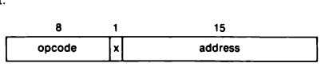
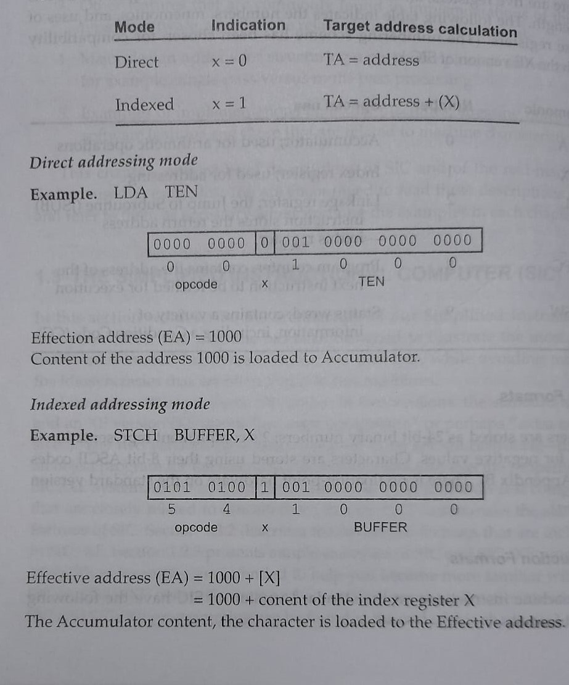
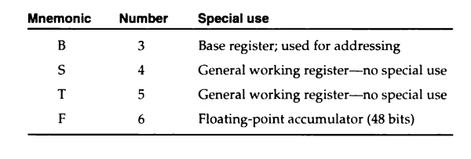
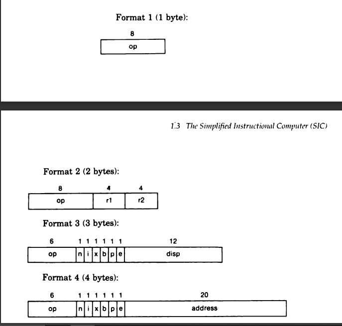
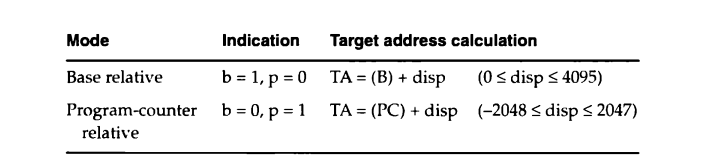
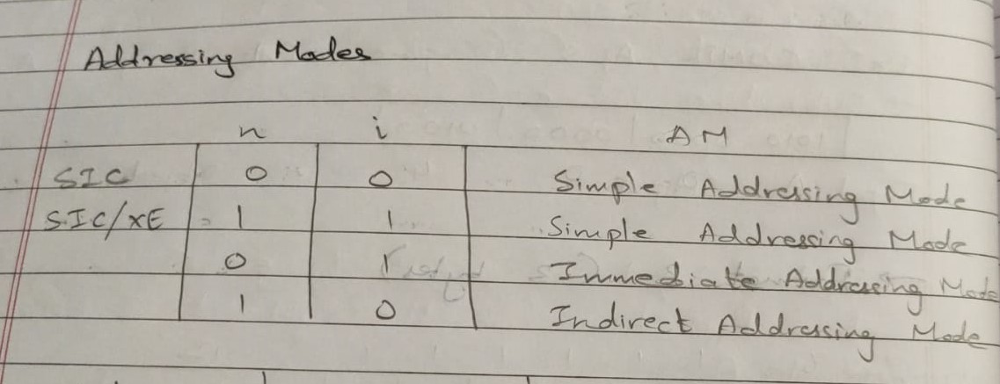
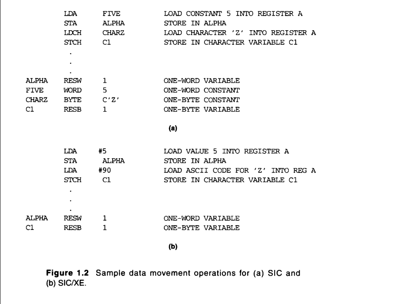

# MODULE 1 : SYSTEM SOFTWARE

>Refer C.W. for problems solved in class.

## System Software and Machine Architecture

* System Softwares are programs that are intended to support the operation and the use of a computer itself.

## Simplified Instructional Computer (SIC)

>Simplified Instructional computer (SIC) is a hypothetical computer that has been designed to include hardware features of the most often found on real machines.

### Machine Architecture

#### Memory

* Memory consists of 8 bit bytes, 3 consecutive bytes form a word.
* All addresses are byte addresses.
* Words are addresses from their lowest numbered byte.
* The capacity of the memory is 32,768 bytes (32.768 KB), or 215 bytes.

#### Registers

* There are 5 registers. All have special uses. All are 24 bits in length.

#### Data Formats

* Int -> 24 bits, Negative integers are represented using 2's complement.
* Char -> 8 bits, same as length of ASCII codes.
* No floating point numbers present.

#### Instruction Formats

* All machine instructions have 24 bit format.
* 8 bits opcode, 1 flag bit _x_ (to indicate indexed addressing mode), 15 bit address.

#### Addressing Modes

* There are 2 addressing modes.
* Direct addressing mode and indexed addressing mode.

#### Instruction Set

* Load and store register instructions: LDA, LDX, STA, STX.
* Instruction for arithmetic operations: ADD, SUB, MUL, DIV.
    * The answer is stored in register A.
    * COMP: compares values of register A and a word from the memory.
* Conditional instructions (JUMP): JLT, JEQ, JGT.
    * JSUB (jump to subroutine)
    * RSUB (return from subroutine)

#### I/O

* I/O is performed by sending 1 byte at a time.

## SIC/XE 

### Machine Architecture

#### Memory

* The memory structure is same as SIC, however the total memory available is 1 MB.
* This increase in memory leads to change in the instruction formats and addressing modes.

#### Registers

* The registers mentioned below are the additional registers provided by SIC/XE.

#### Data Formats

* SIC/XE has included a 48 bit floatng data type, With 1 bit for sign, 11 bits for exponent and 36 bits for fraction.
* Fraction is the number between 0 and 1.

#### Instruction Formats

* The flag _e_ is used to select between fomat 3 (24-bit) and format 4 (32-bit).

#### Addressing Modes

  

* The addressing mode is determined by the flags that are set in the instructions.

#### Instruction Set

* SIC/XE provides 
    * Load and store instructions.
    * Floating point arithmetic operations.

#### I/O

* I/O instructions are same like in SIC.
* I/O channels can be used even while CPU execution, which helps in overlap of computing.

## Programming Examples

## Object code generation
* Refer notes

## 2 Pass Assemblers

