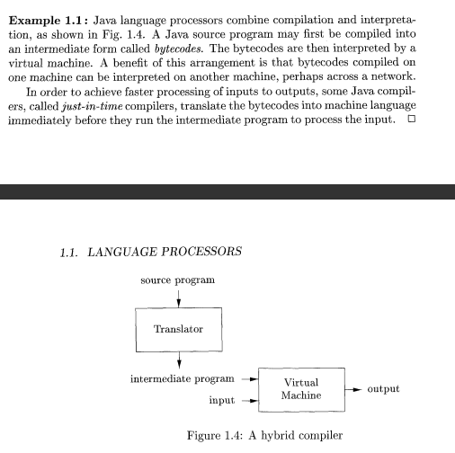
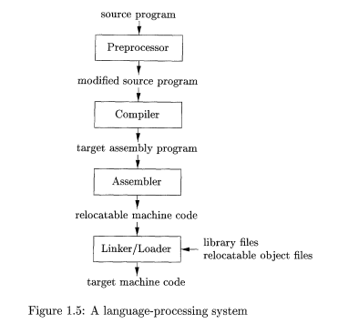
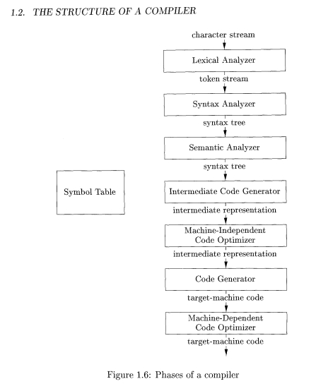
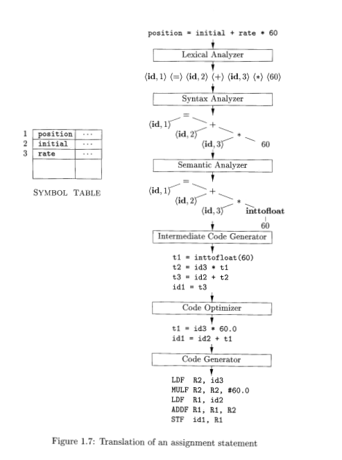

# INTRODUCTION TO COMPILERS

## Language Processors

* Compiler is a program that converts a program in the source language to a target language.
* The compiler's job is to report errors as it translates the language.
* Another language processor is an _interpreter_ which directly translates and executes instructions line by line.
* A compiled program is faster where as interpreter gives better error diagnostics than a compiler.

* The _preprocessor_ is a program that helps the compiler.
* It's main job is to collect source programs, expand shorthands/macros into source language statements.
* This code is then fed into the _compiler_ which produces an assembly level code.
* The _assembler_ processes this assembly language program.
* The assembler produces relocatable code, which which will have to be linked together by a _linker_. 
* The _loader_ puts all the linked executable files into memory for execution.

## The Structure of a Compiler

* COMPILER -> Analysis
           |
           -> Synthesis

* The analysis part:
    1) Breaks source program into constituent parts
    2) Impose grammatical structure
    3) Informs if code is symantically or syntactically unsound.
    4) Also called the front-end of the compiler.

* The synthesis part:
    1) Constructs the target program from the source program.
    2) Also called as the back-end of the compiler.

### Lexical Analysis

* The Lexical Analyzer :
    1) Reads stream of characters making up the source program.
    2) Groups characters into meaningful sequences called lexemes.
    3) It produces outputs in the form of _tokens_ whose structure is _(token-name, attribute-value)_.
    4) These tokens are then passed onto the _syntax analzer_.
    5) The _attribute value points to an entry in the symbol table for this token.

## Evolution of Programming Languages

* Computers were built in the 1940's and were programmed using 1's and 0's i.e. Machine code.
* The operations were really low level, like move data from registers and compare 2 values etc.
* This kind of programming was tedious, slow and error prone, and programs were difficult to understand and modify.

### Move To Higher Level Languages

* The 1st move to higher langauges started with mnemonics for the machine code, this led to the emergence of _assembly_ languages.

