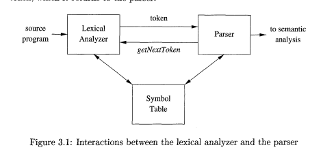
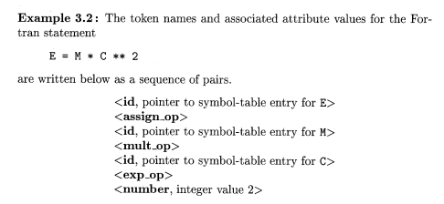
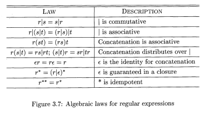
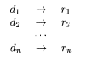
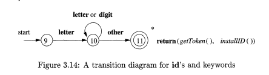

# INTRODUCTION TO COMPILERS

## Language Processors

* Compiler is a program that converts a program in the source language to a target language.
* The compiler's job is to report errors as it translates the language.
* Another language processor is an _interpreter_ which directly translates and executes instructions line by line.
* A compiled program is faster where as interpreter gives better error diagnostics than a compiler.

* The _preprocessor_ is a program that helps the compiler.
* It's main job is to collect source programs, expand shorthands/macros into source language statements.
* This code is then fed into the _compiler_ which produces an assembly level code.
* The _assembler_ processes this assembly language program.
* The assembler produces relocatable code, which which will have to be linked together by a _linker_. 
* The _loader_ puts all the linked executable files into memory for execution.

## The Structure of a Compiler

* COMPILER -> Analysis
           |
           -> Synthesis

* The analysis part:
    1) Breaks source program into constituent parts
    2) Impose grammatical structure
    3) Informs if code is symantically or syntactically unsound.
    4) Also called the front-end of the compiler.

* The synthesis part:
    1) Constructs the target program from the source program.
    2) Also called as the back-end of the compiler.

### Lexical Analysis

* The Lexical Analyzer :
    1) Reads stream of characters making up the source program.
    2) Groups characters into meaningful sequences called lexemes.
    3) It produces outputs in the form of _tokens_ whose structure is _(token-name, attribute-value)_.
    4) These tokens are then passed onto the _syntax analzer_.
    5) The _attribute_ value points to an entry in the symbol table for this token.

## Evolution of Programming Languages

* Computers were built in the 1940's and were programmed using 1's and 0's i.e. Machine code.
* The operations were really low level, like move data from registers and compare 2 values etc.
* This kind of programming was tedious, slow and error prone, and programs were difficult to understand and modify.

### Move To Higher Level Languages

* The 1st move to higher langauges started with mnemonics for the machine code, this led to the emergence of _assembly_ languages.
* Later to assembly languages, macros were added to help write the shorthands in the assembly language.

* Higher level programming languages were developed in the 1950's with _Fortran_, _Cobol_ for business data processing and _Lisp_ for symbolic data computation.
* These higher level programming languages were required to write numerical computations, business applications and symbolic programs.
* More features were added to these languages to make programming more easier, natural and robust.

>These high level programming languages can be classified into generations.

* First Generation: Machine Languages
* Second Generation: Assembly Language
* Third Generation: High Level Languages like Cobol, Fortran, Lisp, C, C++, C#, Java, Python etc.
* Fourth Generation: These languages are built for a particular application like NOMAD, SQL and Postscript.
* Fifth Genereation: These are logic and constraint based languages like Prolog and OPS5.

>Languages are classified based on how the computation takes place, and what computations are to take place i.e. imperative languages and declarative languages.

* Languages like C, C++, C# and Java are imperative languages.
* Imperative languages work on program states, and the satements that are executed alter the states.

* Languages like ML, Haskell and Prolog are declarative languages.
* Declarative programming languages specifies what work is to be done without specifying the control flow.

* Von Nuemann language models are languages that whose computational models are based on the Von Neumann computer architecture. 
* C and Fortran are Von Nuemann languages.

>Languages are classified based on the structure and their functionalities.

* Object Oriented Programming: Style where program consists of objects and them interacting with each other. Ex: C++, C#, Java, etc.

* Scripting Languages: These are interpreted languages which _"glue together"_ computations also called as scripts. Ex:
Awk, JavaScript, Perl, PHP, Python, Ruby and Tcl.

## Science of Building Compiler

* Compiler design help solve real world problems by abstracting the essence of the problem mathematically.
* A compiler must accept all source programs that conform to the specification of the language set.
* The compiler must preserve the meaning of the code being translated/compiled.
* Therefore, compiler writers have influence not only on the compilers that they write, but also on the compiled codes that they generate.
* This leverage makes compiler development challenging.

### Modeling in Compiler Design and Implementation

* Most fundamental models for building a compiler are 
    1) <u>Finite State Machines and Regular Expressions </u>: These models are useful for describing lexical units of a program and for describing algorithms used by the compiler to recognise these units.

    2) <u>Context Free Grammars</u> : These models are used to describe the syntactic structure of programming languages such as nesting of paranthesis and control constructs.

    3) <u>Trees</u> : Model used for representing structure of the program and their translation into object code.

### Science of Code Optimization

* Compiler optimazations have to meet the following design requirements:
    1) The optimized code should be correct.
    2) The optimization must improve performance of many programs.
    3) The compilation time must be reasonable.
    4) The engineering effort must be kept manageable.

Expand on all above 4 points in your own words.

## Applications of Compiler Technology

### Implementation of High Level Programming Languages

* High level programming languages support user-defined aggregated data types, like arrays and structures.
* They also provide high level control flow such as loops and procedure invocation.
* If compilers just convert this into machine code, it will be very inefficient.
* The compiler in its optimizer contains a _data-flow optimization_ unit which analyzes the flow of data through the program and removes redundancies across these constructs.

### Optimization for Computer Architecture

* Parallelism
    * Compilers are developed to translate code from high level to machine level.
    * Computer architectures are built in such a way that multiple instructions can be executed at the same time also called as parallelism.
    * The compiler needs to effectively translate the High level code such that this property of parallelism can be used/exploited.

* Memory Heirarchy
    * The memory heirarchy must be used effectively by the compiler.

### Design of New Computer Architecture

* RISC
    * Compilers played a huge role in the design and development of the RISC architecture.
    * Compiler optimizations often can reduce these instructions to a small number of simpler operations by eliminating the redundancies across complex instructions.
    * It is desirable to build simple instruction sets; compilers can use them effectively and the hardware is much easier to optimize. 

* Specialized Architectures

    * Specailized architectures like VILW and SIMD were developed with the research and development of compilers.

### Program Translations

* <u>Binary translation</u>
    * Compilers can translate 1 binary code written for 1 instruction set to binary code for another instruction set.
    * Helps in increasing availability of software.
    * Binary translations are used to provide backward compatibility also.

* <u>Hardware Synthesis</u>
    * Compilers can synthesize the design of circuits and optimize them.
    * Hardware design is represented at register transfer level. 
    * The variables represent the register and the expression represent the combinational logic.
    * Ex: VHDL, Verilog.

* <u>Database Query Interpreters</u>
    * Compilers built to translate database queries and programs.

* <u>Compiled Simulation</u>
    * Simulations are used to test and validate a design.
    * Inputs given are description of the design and some test parameters.
    * This process takes a lot of time.
    * Instead, we compile the design to produce machine code that simulates that particular design which runs faster. 

### Software Productivity tools

> These are software tools used to find/catch errors for better and faster debugging

* Type Checking
    * Type checking is used to find errors like wrong usage of wrong data type in the operation.
    * This is done by checking the flow of the data through the entire program. 
    * It is also used to detect security holes.

* Bounds Checking
    * Accessing memory out of bounds is a common error in programming but very difficult to detect.
    * Compiler techniques have been used to develop and find buffer overflows in high level languages.
    * These errors are found by the _automated range checkers_ which are a part of the _data-flow analysis_ unit.
    * This can also detect buffer overflows.

* Memory Management Tools
    * Memory leaks is a very dangerous hazard especially in C and C++, the developers themselves need to free allocated memory.
    * To overcome this, _automated garbage collection_ was developed.
    * This automated memory management tool helped in solving all memory related errors.

# LEXICAL ANALYSIS

## Role of a Lexical Analyzer

>The lexical analyzer reads characters -> groups them into lexemes and -> produces a sequence of tokens as output for each lexeme.

* The stream of tokens are then sent to the syntax analyzer to check for syntax validity.
* The lexical analyzer also writes the token and the identifier in the symbol table for future reference. 

* Lexical analysis is divided into 2 processes:

    1. _Scanning_: It consists of the simple processes that do not require tokenization of the input, such as deletion of comments and compaction of consecutive whitespace characters into one.
    2. _Lexical Analysis_: It r is the more complex portion, where the scanner produces the sequence of tokens as output. 

### Separation of Lexical Analysis and Parsing

1. Simplicity of Compiler design: 
    * Lexical analysis helps in removing white spaces and comments, which helps in better syntax analysis.
    * If removal of white spaces and comments were done at parsing, then design of parser would be complicated.

2. Improved Compiler efficiency:
    * Applying specific techniques required for lexical tasks only, help in speeding up lexical analysis.
    * Adding buffering techniques during lexical analysis to speed up the compiler overall.

3. Portability:
    * Compiler portability is enhanced by having a separate lexical analyzer.

### Tokens Patterns and Lexemes

1. Token:
    * Token is a pair of token name and attribute.
    * The token name is an abstract symbol representing a kind of lexical unit.

2. Pattern:
    * The pattern is just the sequence of characters that form the keyword.

3. Lexeme:
    * A lexeme is a sequence of characters in the source program that matches the pattern for a token and is identified by the lexical analyzer as an instance of that token. 

### Attributes of a Token

* When more than one lexeme can match a pattern, the lexical analyzer must provide the subsequent compiler phases additional information about the particular lexeme that matched. 
* For example, the pattern for token number matches both 0 and 1, but it is extremely important for the code generator to know which lexeme was found in the source program. 
* Thus, in many cases the lexical analyzer returns to the parser not only a token name, but an attribute value that describes the lexeme represented by the token; the token name influences parsing decisions, while the attribute value influences translation of tokens after the parse.

### Lexical Errors

>It is hard for a lexical analyzer to tell, without the aid of other components, that there is a source-code error.

* Suppose a situation arises in which the lexical analyzer is unable to proceed because none of the patterns for tokens matches any prefix of the remaining input. The simplest recovery strategy is "panic mode" recovery.
* We delete successive characters from the remaining input, until the lexical analyzer can find a well-formed token at the beginning of what input is left. 
* This recovery technique may confuse the parser, but in an interactive computing environment it may be quite adequate. 

* Other possible error-recovery actions are: 
    1. Delete one character from the remaining input. 
    2. Insert a missing character into the remaining input. 
    3. Replace a character by another character. 
    4. Transpose two adjacent characters.

## Input Buffering

>The task of lexical analysis is made difficult by the fact that we often have to look one or more characters beyond the next lexeme before we can be sure we have the right lexeme.

* There are many situations where we need to look at least one additional character ahead. 
* For instance, we cannot be sure we've seen the end of an identifier until we see a character that is not a letter or digit, and therefore is not part of the lexeme for id.

### Buffer Pairs

>Because of the amount of time taken to process characters and the large number of characters that must be processed during the compilation of a large source program, specialized buffering techniques have been developed to reduce the amount of overhead required to process a single input character. 

* An important scheme involves two buffers that are alternately reloaded, as suggested in Fig

* Each buffer is of the same size N, and N is usually the size of a disk block, e.g., 4096 bytes. 
* We can read N characters into a buffer.
* If fewer than N characters remain in the input file, then a special character, represented by eof, marks the end of the source file and is different from any possible character of the source program.

* Two pointers to the input are maintained: 
1. Pointer _lexemeBegin_, marks the beginning of the current lexeme, whose extent we are attempting to determine. 
2. Pointer _forward_ scans ahead until a pattern match is found; the exact strategy whereby this determination is made will be covered in the balance of this chapter. 

### Sentinels

* The sentinel is a special character that cannot be part of the source program, and a natural choice is the character eof.
* Sentinels are used to keep track of the pointers and make sure they have not gone out of the buffer space.

## Specification of Tokens

>Regular expressions are an important notation for specifying lexeme patterns.

### Strings and Languages

* An alphabet is any finite set of symbols. Typical examples of symbols are letters, digits, and punctuation.
* A string over an alphabet is a finite sequence of symbols drawn from that alphabet. In language theory, the terms "sentence" and "word" are often used as synonyms for "string."
* A language is any countable set of strings over some fixed alphabet. This definition is very broad. Abstract languages like 0, the empty set, or €, the set containing only the empty string, are languages under this definition.

### Operation on Languages

### Regular Expressions

### Regular Definitions

* For notational convenience, we may wish to give names to certain regular expressions and use those names in subsequent expressions, as if the names were themselves symbols. 
* If C is an alphabet of basic symbols, then a regular definition is a sequence of definitions of the form: 

where: 
1. Each di is a new symbol, not in C and not the same as any other of the d's, and 
2. Each ri is a regular expression over the alphabet C U {dl, d2,. . . , di-l). 

## Recognition of Tokens

* Important step in Lexical analysis is to convert regular expression to regular definition of transition diagram.
* Transition diagram has collection of nodes and states and directed edges represent transition from 1 state to another.
* A lexeme is recognised iff it reaches the final state.
* If forward pointer is to be retracted at the end, then '*' should be used at the final state.

### Transition diagrams

* As an intermediate step in the construction of a lexical analyzer, we first convert patterns into stylized flowcharts, called "transition diagrams."

* Transition diagrams have a collection of nodes or circles, called states. Each state represents a condition that could occur during the process of scanning the input looking for a lexeme that matches one of several patterns.

* Edges are directed from one state of the transition diagram to another. Each edge is labeled by a symbol or set of symbols.

