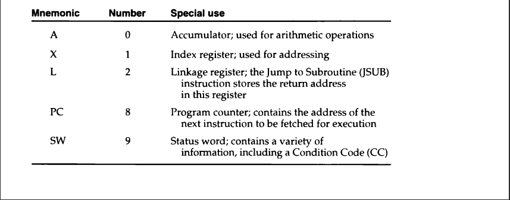
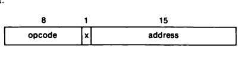

# MODULE 1 : SYSTEM SOFTWARE

## System Software and Machine Architecture

* System Softwares are programs that are intended to support the operation and the use of a computer itself.

## Simplified Instructional Computer (SIC)

>Simplified Instructional computer (SIC) is a hypothetical computer that has been designed to include hardware features of the most often found on real machines.

### Machine Architecture

#### Memory

* Memory consists of 8 bit bytes, 3 consecutive bytes form a word.
* All addresses are byte addresses.
* Words are addresses from their lowest numbered byte.
* The capacity of the memory is 32,768 bytes (32.768 KB), or 215 bytes.

#### Registers

* There are 5 registers. All have special uses. All are 24 bits in length.

#### Data Formats

* Int -> 24 bits, Negative integers are represented using 2's complement.
* Char -> 8 bits, same as length of ASCII codes.
* No floating point numbers present.

#### Instruction Formats

* All machine instructions have 24 bit format.
* 8 bits opcode, 1 flag bit _x_ (to indicate indexed addressing mode), 15 bit address.

#### Addressing Modes
